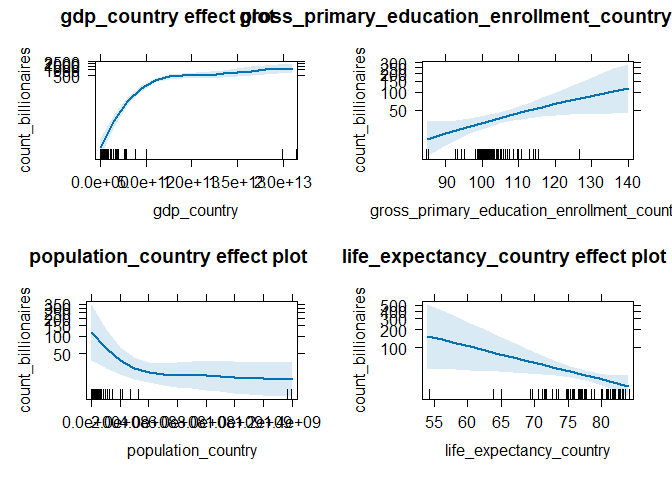
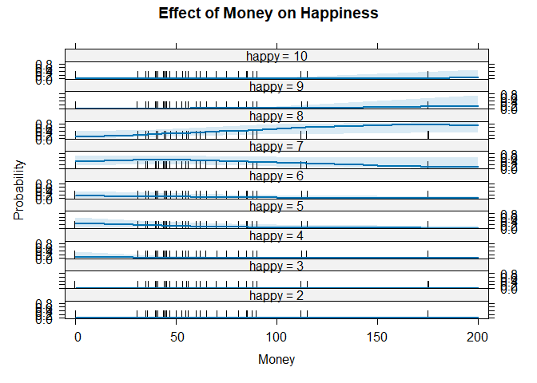
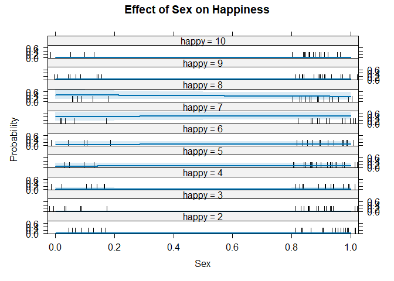
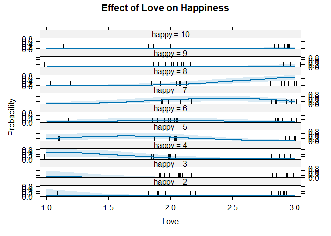
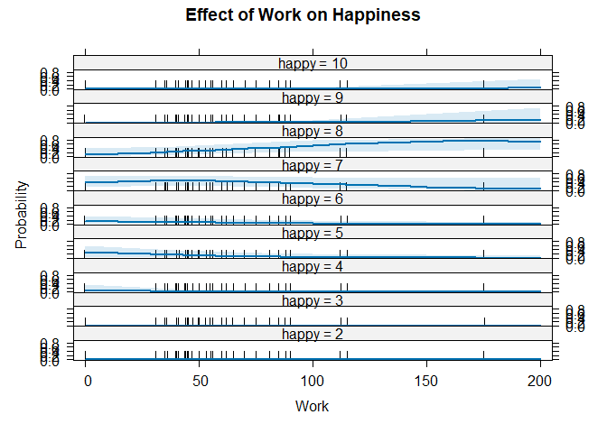
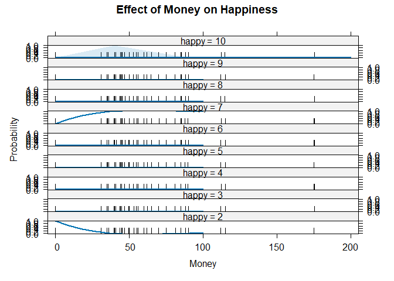
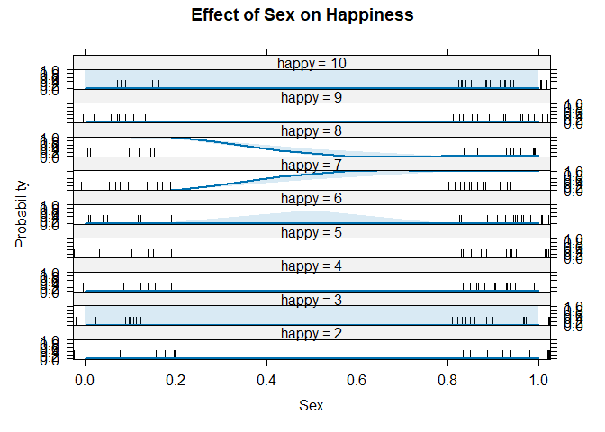
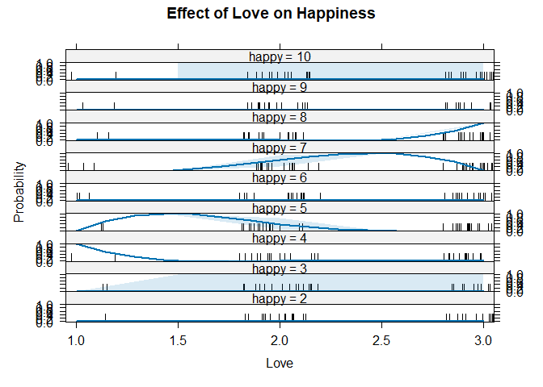
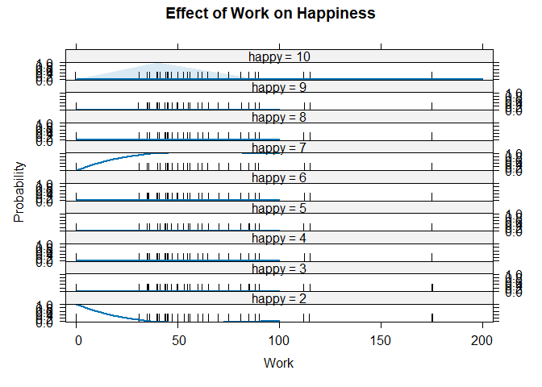

Homework 3
================

Complete the assignment below. Make sure you answer each part of the
questions. Submit your responses on eCampus as both an .RMD file and a
knitted .pdf file. This assignment is due by 2/4.

# Problem 1

The [Billionaires Statistics
Dataset](https://www.kaggle.com/datasets/nelgiriyewithana/billionaires-statistics-dataset/data)
is a dataset from Kaggle (.csv included in eCampus attachments) that
contains information on the world’s billionaires and the countries in
which they reside. You can find more information on the dataset using
the link above.

``` r
library(readr)
Billionaires_Statistics_Dataset <- read_csv("Billionaires Statistics Dataset.csv")
```

    ## Rows: 2640 Columns: 35
    ## ── Column specification ────────────────────────────────────────────────────────
    ## Delimiter: ","
    ## chr (18): category, personName, country, city, source, industries, countryOf...
    ## dbl (16): rank, finalWorth, age, birthYear, birthMonth, birthDay, cpi_countr...
    ## lgl  (1): selfMade
    ## 
    ## ℹ Use `spec()` to retrieve the full column specification for this data.
    ## ℹ Specify the column types or set `show_col_types = FALSE` to quiet this message.

``` r
str(Billionaires_Statistics_Dataset)
```

    ## spc_tbl_ [2,640 × 35] (S3: spec_tbl_df/tbl_df/tbl/data.frame)
    ##  $ rank                                      : num [1:2640] 1 2 3 4 5 6 7 8 9 10 ...
    ##  $ finalWorth                                : num [1:2640] 211000 180000 114000 107000 106000 104000 94500 93000 83400 80700 ...
    ##  $ category                                  : chr [1:2640] "Fashion & Retail" "Automotive" "Technology" "Technology" ...
    ##  $ personName                                : chr [1:2640] "Bernard Arnault & family" "Elon Musk" "Jeff Bezos" "Larry Ellison" ...
    ##  $ age                                       : num [1:2640] 74 51 59 78 92 67 81 83 65 67 ...
    ##  $ country                                   : chr [1:2640] "France" "United States" "United States" "United States" ...
    ##  $ city                                      : chr [1:2640] "Paris" "Austin" "Medina" "Lanai" ...
    ##  $ source                                    : chr [1:2640] "LVMH" "Tesla, SpaceX" "Amazon" "Oracle" ...
    ##  $ industries                                : chr [1:2640] "Fashion & Retail" "Automotive" "Technology" "Technology" ...
    ##  $ countryOfCitizenship                      : chr [1:2640] "France" "United States" "United States" "United States" ...
    ##  $ organization                              : chr [1:2640] "LVMH Moët Hennessy Louis Vuitton" "Tesla" "Amazon" "Oracle" ...
    ##  $ selfMade                                  : logi [1:2640] FALSE TRUE TRUE TRUE TRUE TRUE ...
    ##  $ status                                    : chr [1:2640] "U" "D" "D" "U" ...
    ##  $ gender                                    : chr [1:2640] "M" "M" "M" "M" ...
    ##  $ birthDate                                 : chr [1:2640] "3/5/1949 0:00" "6/28/1971 0:00" "1/12/1964 0:00" "8/17/1944 0:00" ...
    ##  $ lastName                                  : chr [1:2640] "Arnault" "Musk" "Bezos" "Ellison" ...
    ##  $ firstName                                 : chr [1:2640] "Bernard" "Elon" "Jeff" "Larry" ...
    ##  $ title                                     : chr [1:2640] "Chairman and CEO" "CEO" "Chairman and Founder" "CTO and Founder" ...
    ##  $ date                                      : chr [1:2640] "4/4/2023 5:01" "4/4/2023 5:01" "4/4/2023 5:01" "4/4/2023 5:01" ...
    ##  $ state                                     : chr [1:2640] NA "Texas" "Washington" "Hawaii" ...
    ##  $ residenceStateRegion                      : chr [1:2640] NA "South" "West" "West" ...
    ##  $ birthYear                                 : num [1:2640] 1949 1971 1964 1944 1930 ...
    ##  $ birthMonth                                : num [1:2640] 3 6 1 8 8 10 2 1 4 3 ...
    ##  $ birthDay                                  : num [1:2640] 5 28 12 17 30 28 14 28 19 24 ...
    ##  $ cpi_country                               : num [1:2640] 110 117 117 117 117 ...
    ##  $ cpi_change_country                        : num [1:2640] 1.1 7.5 7.5 7.5 7.5 7.5 7.5 3.6 7.7 7.5 ...
    ##  $ gdp_country                               : chr [1:2640] "$2,715,518,274,227" "$21,427,700,000,000" "$21,427,700,000,000" "$21,427,700,000,000" ...
    ##  $ gross_tertiary_education_enrollment       : num [1:2640] 65.6 88.2 88.2 88.2 88.2 88.2 88.2 40.2 28.1 88.2 ...
    ##  $ gross_primary_education_enrollment_country: num [1:2640] 102 102 102 102 102 ...
    ##  $ life_expectancy_country                   : num [1:2640] 82.5 78.5 78.5 78.5 78.5 78.5 78.5 75 69.4 78.5 ...
    ##  $ tax_revenue_country_country               : num [1:2640] 24.2 9.6 9.6 9.6 9.6 9.6 9.6 13.1 11.2 9.6 ...
    ##  $ total_tax_rate_country                    : num [1:2640] 60.7 36.6 36.6 36.6 36.6 36.6 36.6 55.1 49.7 36.6 ...
    ##  $ population_country                        : num [1:2640] 6.71e+07 3.28e+08 3.28e+08 3.28e+08 3.28e+08 ...
    ##  $ latitude_country                          : num [1:2640] 46.2 37.1 37.1 37.1 37.1 ...
    ##  $ longitude_country                         : num [1:2640] 2.21 -95.71 -95.71 -95.71 -95.71 ...
    ##  - attr(*, "spec")=
    ##   .. cols(
    ##   ..   rank = col_double(),
    ##   ..   finalWorth = col_double(),
    ##   ..   category = col_character(),
    ##   ..   personName = col_character(),
    ##   ..   age = col_double(),
    ##   ..   country = col_character(),
    ##   ..   city = col_character(),
    ##   ..   source = col_character(),
    ##   ..   industries = col_character(),
    ##   ..   countryOfCitizenship = col_character(),
    ##   ..   organization = col_character(),
    ##   ..   selfMade = col_logical(),
    ##   ..   status = col_character(),
    ##   ..   gender = col_character(),
    ##   ..   birthDate = col_character(),
    ##   ..   lastName = col_character(),
    ##   ..   firstName = col_character(),
    ##   ..   title = col_character(),
    ##   ..   date = col_character(),
    ##   ..   state = col_character(),
    ##   ..   residenceStateRegion = col_character(),
    ##   ..   birthYear = col_double(),
    ##   ..   birthMonth = col_double(),
    ##   ..   birthDay = col_double(),
    ##   ..   cpi_country = col_double(),
    ##   ..   cpi_change_country = col_double(),
    ##   ..   gdp_country = col_character(),
    ##   ..   gross_tertiary_education_enrollment = col_double(),
    ##   ..   gross_primary_education_enrollment_country = col_double(),
    ##   ..   life_expectancy_country = col_double(),
    ##   ..   tax_revenue_country_country = col_double(),
    ##   ..   total_tax_rate_country = col_double(),
    ##   ..   population_country = col_double(),
    ##   ..   latitude_country = col_double(),
    ##   ..   longitude_country = col_double()
    ##   .. )
    ##  - attr(*, "problems")=<externalptr>

``` r
summary(Billionaires_Statistics_Dataset)
```

    ##       rank        finalWorth       category          personName       
    ##  Min.   :   1   Min.   :  1000   Length:2640        Length:2640       
    ##  1st Qu.: 659   1st Qu.:  1500   Class :character   Class :character  
    ##  Median :1312   Median :  2300   Mode  :character   Mode  :character  
    ##  Mean   :1289   Mean   :  4624                                        
    ##  3rd Qu.:1905   3rd Qu.:  4200                                        
    ##  Max.   :2540   Max.   :211000                                        
    ##                                                                       
    ##       age           country              city              source         
    ##  Min.   : 18.00   Length:2640        Length:2640        Length:2640       
    ##  1st Qu.: 56.00   Class :character   Class :character   Class :character  
    ##  Median : 65.00   Mode  :character   Mode  :character   Mode  :character  
    ##  Mean   : 65.14                                                           
    ##  3rd Qu.: 75.00                                                           
    ##  Max.   :101.00                                                           
    ##  NA's   :65                                                               
    ##   industries        countryOfCitizenship organization        selfMade      
    ##  Length:2640        Length:2640          Length:2640        Mode :logical  
    ##  Class :character   Class :character     Class :character   FALSE:828      
    ##  Mode  :character   Mode  :character     Mode  :character   TRUE :1812     
    ##                                                                            
    ##                                                                            
    ##                                                                            
    ##                                                                            
    ##     status             gender           birthDate           lastName        
    ##  Length:2640        Length:2640        Length:2640        Length:2640       
    ##  Class :character   Class :character   Class :character   Class :character  
    ##  Mode  :character   Mode  :character   Mode  :character   Mode  :character  
    ##                                                                             
    ##                                                                             
    ##                                                                             
    ##                                                                             
    ##   firstName            title               date              state          
    ##  Length:2640        Length:2640        Length:2640        Length:2640       
    ##  Class :character   Class :character   Class :character   Class :character  
    ##  Mode  :character   Mode  :character   Mode  :character   Mode  :character  
    ##                                                                             
    ##                                                                             
    ##                                                                             
    ##                                                                             
    ##  residenceStateRegion   birthYear      birthMonth       birthDay   
    ##  Length:2640          Min.   :1921   Min.   : 1.00   Min.   : 1.0  
    ##  Class :character     1st Qu.:1948   1st Qu.: 2.00   1st Qu.: 1.0  
    ##  Mode  :character     Median :1957   Median : 6.00   Median :11.0  
    ##                       Mean   :1957   Mean   : 5.74   Mean   :12.1  
    ##                       3rd Qu.:1966   3rd Qu.: 9.00   3rd Qu.:21.0  
    ##                       Max.   :2004   Max.   :12.00   Max.   :31.0  
    ##                       NA's   :76     NA's   :76      NA's   :76    
    ##   cpi_country     cpi_change_country gdp_country       
    ##  Min.   : 99.55   Min.   :-1.900     Length:2640       
    ##  1st Qu.:117.24   1st Qu.: 1.700     Class :character  
    ##  Median :117.24   Median : 2.900     Mode  :character  
    ##  Mean   :127.76   Mean   : 4.364                       
    ##  3rd Qu.:125.08   3rd Qu.: 7.500                       
    ##  Max.   :288.57   Max.   :53.500                       
    ##  NA's   :184      NA's   :184                          
    ##  gross_tertiary_education_enrollment gross_primary_education_enrollment_country
    ##  Min.   :  4.00                      Min.   : 84.7                             
    ##  1st Qu.: 50.60                      1st Qu.:100.2                             
    ##  Median : 65.60                      Median :101.8                             
    ##  Mean   : 67.23                      Mean   :102.9                             
    ##  3rd Qu.: 88.20                      3rd Qu.:102.6                             
    ##  Max.   :136.60                      Max.   :142.1                             
    ##  NA's   :182                         NA's   :181                               
    ##  life_expectancy_country tax_revenue_country_country total_tax_rate_country
    ##  Min.   :54.30           Min.   : 0.10               Min.   :  9.90        
    ##  1st Qu.:77.00           1st Qu.: 9.60               1st Qu.: 36.60        
    ##  Median :78.50           Median : 9.60               Median : 41.20        
    ##  Mean   :78.12           Mean   :12.55               Mean   : 43.96        
    ##  3rd Qu.:80.90           3rd Qu.:12.80               3rd Qu.: 59.10        
    ##  Max.   :84.20           Max.   :37.20               Max.   :106.30        
    ##  NA's   :182             NA's   :183                 NA's   :182           
    ##  population_country  latitude_country longitude_country
    ##  Min.   :3.802e+04   Min.   :-40.90   Min.   :-106.35  
    ##  1st Qu.:6.683e+07   1st Qu.: 35.86   1st Qu.: -95.71  
    ##  Median :3.282e+08   Median : 37.09   Median :  10.45  
    ##  Mean   :5.102e+08   Mean   : 34.90   Mean   :  12.58  
    ##  3rd Qu.:1.366e+09   3rd Qu.: 40.46   3rd Qu.: 104.20  
    ##  Max.   :1.398e+09   Max.   : 61.92   Max.   : 174.89  
    ##  NA's   :164         NA's   :164      NA's   :164

For this analysis, consider a scenario where you work for a wealth
management firm that is looking to expand its operations to new
countries. Your job is to understand what factors are associated with
the number of billionaires in a country. Ultimately your firm will cross
reference this information with industry forecasts on country GDP
growth, etc. to determine which countries are most likely to have the
highest growth in the number of billionaires in the next 10 years
(outside the scope of this assignment). For now, you will build a model
focusing on the factors associated with the number of billionaires in a
country.

Before we can model this, we must summarize the data by country. We will
count the number of billionaires per country and use the first
observation for each country to summarize the country specific
statistics. To do this we use the `tidyverse` package (note, you do not
have to understand this code but if you are interested in learning more
about `tidyverse` see the corresponding Module X section).

``` r
library(tidyverse)
```

    ## ── Attaching core tidyverse packages ──────────────────────── tidyverse 2.0.0 ──
    ## ✔ dplyr     1.1.2     ✔ purrr     1.0.2
    ## ✔ forcats   1.0.0     ✔ stringr   1.5.0
    ## ✔ ggplot2   3.4.4     ✔ tibble    3.2.1
    ## ✔ lubridate 1.9.3     ✔ tidyr     1.3.0
    ## ── Conflicts ────────────────────────────────────────── tidyverse_conflicts() ──
    ## ✖ dplyr::filter() masks stats::filter()
    ## ✖ dplyr::lag()    masks stats::lag()
    ## ℹ Use the conflicted package (<http://conflicted.r-lib.org/>) to force all conflicts to become errors

``` r
BillionairesByCountry <- Billionaires_Statistics_Dataset %>%                       
  select(country,
         gdp_country,
         gross_tertiary_education_enrollment,
         gross_primary_education_enrollment_country,
         life_expectancy_country,
         tax_revenue_country_country,
         total_tax_rate_country,
         population_country,
         latitude_country,
         longitude_country)%>% # select only the columns we are interested in
  group_by(country)%>% # group by country
  summarise(count_billionaires=n(),
            gdp_country = first(gdp_country),
            gross_tertiary_education_enrollment = first(gross_tertiary_education_enrollment),
            gross_primary_education_enrollment_country = first(gross_primary_education_enrollment_country),
            life_expectancy_country = first(life_expectancy_country),
            tax_revenue_country_country = first(tax_revenue_country_country),
            total_tax_rate_country = first(total_tax_rate_country),
            population_country = first(population_country),
            latitude_country = first(latitude_country),
            longitude_country = first(longitude_country))%>% # summarize by country
  mutate(gdp_country=as.numeric(gsub("\\$|\\,", "", gdp_country))) # fix a problem with GDP being a string
```

``` r
BillionairesByCountry2 <- na.omit(BillionairesByCountry)
summary(BillionairesByCountry2)
```

    ##    country          count_billionaires  gdp_country       
    ##  Length:65          Min.   :  1.0      Min.   :1.367e+10  
    ##  Class :character   1st Qu.:  2.0      1st Qu.:1.610e+11  
    ##  Mode  :character   Median :  6.0      Median :3.514e+11  
    ##                     Mean   : 37.8      Mean   :1.327e+12  
    ##                     3rd Qu.: 26.0      3rd Qu.:9.091e+11  
    ##                     Max.   :754.0      Max.   :2.143e+13  
    ##  gross_tertiary_education_enrollment gross_primary_education_enrollment_country
    ##  Min.   :  4.00                      Min.   : 84.7                             
    ##  1st Qu.: 36.80                      1st Qu.:100.0                             
    ##  Median : 61.70                      Median :102.3                             
    ##  Mean   : 57.81                      Mean   :103.4                             
    ##  3rd Qu.: 80.60                      3rd Qu.:106.2                             
    ##  Max.   :136.60                      Max.   :142.1                             
    ##  life_expectancy_country tax_revenue_country_country total_tax_rate_country
    ##  Min.   :54.30           Min.   : 0.1                Min.   :  9.90        
    ##  1st Qu.:75.00           1st Qu.:12.5                1st Qu.: 29.20        
    ##  Median :77.60           Median :17.1                Median : 38.10        
    ##  Mean   :77.25           Mean   :17.5                Mean   : 39.37        
    ##  3rd Qu.:81.60           3rd Qu.:23.0                3rd Qu.: 47.00        
    ##  Max.   :84.20           Max.   :37.2                Max.   :106.30        
    ##  population_country  latitude_country longitude_country 
    ##  Min.   :6.454e+05   Min.   :-40.90   Min.   :-106.347  
    ##  1st Qu.:8.575e+06   1st Qu.: 14.06   1st Qu.:   5.291  
    ##  Median :2.861e+07   Median : 35.91   Median :  24.603  
    ##  Mean   :8.960e+07   Mean   : 27.96   Mean   :  30.096  
    ##  3rd Qu.:6.683e+07   3rd Qu.: 48.02   3rd Qu.:  64.585  
    ##  Max.   :1.398e+09   Max.   : 61.92   Max.   : 174.886

``` r
str(BillionairesByCountry2)
```

    ## tibble [65 × 11] (S3: tbl_df/tbl/data.frame)
    ##  $ country                                   : chr [1:65] "Algeria" "Argentina" "Armenia" "Australia" ...
    ##  $ count_billionaires                        : int [1:65] 1 4 1 43 11 1 3 44 1 42 ...
    ##  $ gdp_country                               : num [1:65] 1.70e+11 4.50e+11 1.37e+10 1.39e+12 4.46e+11 ...
    ##  $ gross_tertiary_education_enrollment       : num [1:65] 51.4 90 54.6 113.1 85.1 ...
    ##  $ gross_primary_education_enrollment_country: num [1:65] 109.9 109.7 92.7 100.3 103.1 ...
    ##  $ life_expectancy_country                   : num [1:65] 76.7 76.5 74.9 82.7 81.6 77.2 81.6 75.7 69.6 81.9 ...
    ##  $ tax_revenue_country_country               : num [1:65] 37.2 10.1 20.9 23 25.4 4.2 24 14.2 17.1 12.8 ...
    ##  $ total_tax_rate_country                    : num [1:65] 66.1 106.3 22.6 47.4 51.4 ...
    ##  $ population_country                        : num [1:65] 43053054 44938712 2957731 25766605 8877067 ...
    ##  $ latitude_country                          : num [1:65] 28 -38.4 40.1 -25.3 47.5 ...
    ##  $ longitude_country                         : num [1:65] 1.66 -63.62 45.04 133.78 14.55 ...
    ##  - attr(*, "na.action")= 'omit' Named int [1:14] 2 7 10 12 15 23 29 30 34 41 ...
    ##   ..- attr(*, "names")= chr [1:14] "2" "7" "10" "12" ...

Now you have the summarized dataset `BillionairesByCountry`. Use this
dataset to:

1)  Build a Poisson regression model to predict the number of
    billionaires per country (`count_billionaires`) using the other
    variables in the dataset (except for `country`). Note: It is
    industry standard to use a `log` transform when using large
    financial metrics such as `gdp_country` and
    `tax_revenue_country_country` as predictors so make sure you do
    that. Note: you will have to deal with “NAs”, do so using `na.omit`.

### Attribute selection and model formulation

``` r
library(car)
```

    ## Loading required package: carData

    ## 
    ## Attaching package: 'car'

    ## The following object is masked from 'package:dplyr':
    ## 
    ##     recode

    ## The following object is masked from 'package:purrr':
    ## 
    ##     some

``` r
library(dplyr)
library(faraway)
```

    ## 
    ## Attaching package: 'faraway'

    ## The following objects are masked from 'package:car':
    ## 
    ##     logit, vif

``` r
library(effects)
```

    ## lattice theme set by effectsTheme()
    ## See ?effectsTheme for details.

``` r
BillionairesByCountry2 %>%
  powerTransform(
    cbind(
      gdp_country,
      gross_tertiary_education_enrollment,
      gross_primary_education_enrollment_country,
      life_expectancy_country,
      tax_revenue_country_country,
      population_country
    ) ~ count_billionaires,
    data = .
  ) %>%
  summary()
```

    ## bcPower Transformations to Multinormality 
    ##                                            Est Power Rounded Pwr Wald Lwr Bnd
    ## gdp_country                                   0.1861        0.19       0.0924
    ## gross_tertiary_education_enrollment           0.7393        1.00       0.4043
    ## gross_primary_education_enrollment_country   -1.7435        0.00      -3.5018
    ## life_expectancy_country                       6.6452        6.65       4.3934
    ## tax_revenue_country_country                   0.9027        1.00       0.6039
    ## population_country                            0.0673        0.00      -0.0024
    ##                                            Wald Upr Bnd
    ## gdp_country                                      0.2798
    ## gross_tertiary_education_enrollment              1.0743
    ## gross_primary_education_enrollment_country       0.0148
    ## life_expectancy_country                          8.8971
    ## tax_revenue_country_country                      1.2015
    ## population_country                               0.1371
    ## 
    ## Likelihood ratio test that transformation parameters are equal to 0
    ##  (all log transformations)
    ##                                    LRT df       pval
    ## LR test, lambda = (0 0 0 0 0 0) 159.12  6 < 2.22e-16
    ## 
    ## Likelihood ratio test that no transformations are needed
    ##                                      LRT df       pval
    ## LR test, lambda = (1 1 1 1 1 1) 481.9502  6 < 2.22e-16

``` r
pmod1 <- glm(count_billionaires ~ log(gdp_country) + log(gross_primary_education_enrollment_country) + log(population_country)+ gross_tertiary_education_enrollment + life_expectancy_country, data = BillionairesByCountry2, family = "poisson")

summary(pmod1)
```

    ## 
    ## Call:
    ## glm(formula = count_billionaires ~ log(gdp_country) + log(gross_primary_education_enrollment_country) + 
    ##     log(population_country) + gross_tertiary_education_enrollment + 
    ##     life_expectancy_country, family = "poisson", data = BillionairesByCountry2)
    ## 
    ## Coefficients:
    ##                                                   Estimate Std. Error z value
    ## (Intercept)                                     -4.009e+01  2.371e+00 -16.910
    ## log(gdp_country)                                 1.264e+00  4.550e-02  27.781
    ## log(gross_primary_education_enrollment_country)  3.854e+00  4.659e-01   8.272
    ## log(population_country)                         -2.500e-01  4.721e-02  -5.297
    ## gross_tertiary_education_enrollment             -4.574e-04  1.654e-03  -0.277
    ## life_expectancy_country                         -6.335e-02  8.032e-03  -7.887
    ##                                                 Pr(>|z|)    
    ## (Intercept)                                      < 2e-16 ***
    ## log(gdp_country)                                 < 2e-16 ***
    ## log(gross_primary_education_enrollment_country)  < 2e-16 ***
    ## log(population_country)                         1.18e-07 ***
    ## gross_tertiary_education_enrollment                0.782    
    ## life_expectancy_country                         3.09e-15 ***
    ## ---
    ## Signif. codes:  0 '***' 0.001 '**' 0.01 '*' 0.05 '.' 0.1 ' ' 1
    ## 
    ## (Dispersion parameter for poisson family taken to be 1)
    ## 
    ##     Null deviance: 7527.27  on 64  degrees of freedom
    ## Residual deviance:  502.43  on 59  degrees of freedom
    ## AIC: 770.1
    ## 
    ## Number of Fisher Scoring iterations: 5

### Stepwise selection

2)  Use `step` for model feature selection.

``` r
pmod2 <- glm(count_billionaires ~ log(gdp_country) + log(gross_primary_education_enrollment_country) + log(population_country)+ gross_tertiary_education_enrollment + life_expectancy_country, data = BillionairesByCountry2, family = "poisson") %>% 
  step
```

    ## Start:  AIC=770.1
    ## count_billionaires ~ log(gdp_country) + log(gross_primary_education_enrollment_country) + 
    ##     log(population_country) + gross_tertiary_education_enrollment + 
    ##     life_expectancy_country
    ## 
    ##                                                   Df Deviance     AIC
    ## - gross_tertiary_education_enrollment              1   502.50  768.18
    ## <none>                                                 502.43  770.10
    ## - log(population_country)                          1   529.77  795.44
    ## - life_expectancy_country                          1   558.43  824.11
    ## - log(gross_primary_education_enrollment_country)  1   568.47  834.15
    ## - log(gdp_country)                                 1  1330.02 1595.69
    ## 
    ## Step:  AIC=768.18
    ## count_billionaires ~ log(gdp_country) + log(gross_primary_education_enrollment_country) + 
    ##     log(population_country) + life_expectancy_country
    ## 
    ##                                                   Df Deviance     AIC
    ## <none>                                                 502.50  768.18
    ## - log(population_country)                          1   551.26  814.94
    ## - life_expectancy_country                          1   559.65  823.33
    ## - log(gross_primary_education_enrollment_country)  1   569.14  832.82
    ## - log(gdp_country)                                 1  1914.36 2178.04

``` r
summary(pmod2)
```

    ## 
    ## Call:
    ## glm(formula = count_billionaires ~ log(gdp_country) + log(gross_primary_education_enrollment_country) + 
    ##     log(population_country) + life_expectancy_country, family = "poisson", 
    ##     data = BillionairesByCountry2)
    ## 
    ## Coefficients:
    ##                                                   Estimate Std. Error z value
    ## (Intercept)                                     -39.991716   2.349100 -17.024
    ## log(gdp_country)                                  1.255102   0.031751  39.530
    ## log(gross_primary_education_enrollment_country)   3.841065   0.464221   8.274
    ## log(population_country)                          -0.241075   0.034370  -7.014
    ## life_expectancy_country                          -0.063019   0.007957  -7.920
    ##                                                 Pr(>|z|)    
    ## (Intercept)                                      < 2e-16 ***
    ## log(gdp_country)                                 < 2e-16 ***
    ## log(gross_primary_education_enrollment_country)  < 2e-16 ***
    ## log(population_country)                         2.31e-12 ***
    ## life_expectancy_country                         2.38e-15 ***
    ## ---
    ## Signif. codes:  0 '***' 0.001 '**' 0.01 '*' 0.05 '.' 0.1 ' ' 1
    ## 
    ## (Dispersion parameter for poisson family taken to be 1)
    ## 
    ##     Null deviance: 7527.3  on 64  degrees of freedom
    ## Residual deviance:  502.5  on 60  degrees of freedom
    ## AIC: 768.18
    ## 
    ## Number of Fisher Scoring iterations: 5

### Dispersion and effects plot

3)  Check for overdispersion/ underdispersion and account for it in your
    final model if necessary.

``` r
dp <- sum(residuals(pmod1,type="pearson")^2)/pmod1$df.res
dp
```

    ## [1] 11.08115

``` r
summary(pmod2,dispersion=dp)
```

    ## 
    ## Call:
    ## glm(formula = count_billionaires ~ log(gdp_country) + log(gross_primary_education_enrollment_country) + 
    ##     log(population_country) + life_expectancy_country, family = "poisson", 
    ##     data = BillionairesByCountry2)
    ## 
    ## Coefficients:
    ##                                                  Estimate Std. Error z value
    ## (Intercept)                                     -39.99172    7.81977  -5.114
    ## log(gdp_country)                                  1.25510    0.10569  11.875
    ## log(gross_primary_education_enrollment_country)   3.84106    1.54532   2.486
    ## log(population_country)                          -0.24107    0.11441  -2.107
    ## life_expectancy_country                          -0.06302    0.02649  -2.379
    ##                                                 Pr(>|z|)    
    ## (Intercept)                                     3.15e-07 ***
    ## log(gdp_country)                                 < 2e-16 ***
    ## log(gross_primary_education_enrollment_country)   0.0129 *  
    ## log(population_country)                           0.0351 *  
    ## life_expectancy_country                           0.0174 *  
    ## ---
    ## Signif. codes:  0 '***' 0.001 '**' 0.01 '*' 0.05 '.' 0.1 ' ' 1
    ## 
    ## (Dispersion parameter for poisson family taken to be 11.08115)
    ## 
    ##     Null deviance: 7527.3  on 64  degrees of freedom
    ## Residual deviance:  502.5  on 60  degrees of freedom
    ## AIC: 768.18
    ## 
    ## Number of Fisher Scoring iterations: 5

``` r
qpmod1 <- glm(count_billionaires ~ log(gdp_country) + log(gross_primary_education_enrollment_country) + log(population_country)+ life_expectancy_country, data = BillionairesByCountry2, family = "quasipoisson") 

summary(qpmod1)
```

    ## 
    ## Call:
    ## glm(formula = count_billionaires ~ log(gdp_country) + log(gross_primary_education_enrollment_country) + 
    ##     log(population_country) + life_expectancy_country, family = "quasipoisson", 
    ##     data = BillionairesByCountry2)
    ## 
    ## Coefficients:
    ##                                                  Estimate Std. Error t value
    ## (Intercept)                                     -39.99172    7.76295  -5.152
    ## log(gdp_country)                                  1.25510    0.10493  11.962
    ## log(gross_primary_education_enrollment_country)   3.84106    1.53409   2.504
    ## log(population_country)                          -0.24107    0.11358  -2.123
    ## life_expectancy_country                          -0.06302    0.02630  -2.397
    ##                                                 Pr(>|t|)    
    ## (Intercept)                                     3.03e-06 ***
    ## log(gdp_country)                                 < 2e-16 ***
    ## log(gross_primary_education_enrollment_country)   0.0150 *  
    ## log(population_country)                           0.0379 *  
    ## life_expectancy_country                           0.0197 *  
    ## ---
    ## Signif. codes:  0 '***' 0.001 '**' 0.01 '*' 0.05 '.' 0.1 ' ' 1
    ## 
    ## (Dispersion parameter for quasipoisson family taken to be 10.9207)
    ## 
    ##     Null deviance: 7527.3  on 64  degrees of freedom
    ## Residual deviance:  502.5  on 60  degrees of freedom
    ## AIC: NA
    ## 
    ## Number of Fisher Scoring iterations: 5

3)  Use the `effects` library to create effects plots for the final
    model (remember to adjust the `fig.height` and `fig.width` chunk
    options so that the plots look nice).

``` r
plot(allEffects(qpmod1), fig.width = 8, fig.height = 12)
```

<!-- -->

### Summary for supervisor

4)  Write a summary of your methodology for your direct supervisor. You
    direct supervisor has a similar statistical background as you, but
    does not use it on a daily basis so you will need to briefly refresh
    them on the statistical concepts you used and explain your
    methodology in detail. You know from previous experience that your
    supervisor is will be interested in why you did not use `country` as
    a predictor, why you used a `log` transform for large financial
    metrics, why you chose to omit “NAs”, and how you accounted for
    overdispersion/ underdispersion.

I began by loading and preparing the billionaires dataset for analysis.
During this process, I selected relevant variables, grouped the data by
country, and performed a powertransform to see which variables would
benefit from a log transformation. I then used na.omit to handle missing
values. The next step in my analysis was to build a Poisson regression
model. I chose the Poisson model because the response variable, the
count of billionaires per country, is a count data which typically
follows a Poisson distribution. I transformed large financial metrics
like GDP and tax revenue to reduce skewness, stabilize variance, and
improve the model’s linearity assumption as indicated by the power
transform function. I checked for overdispersion in our Poisson model.
Overdispersion occurs when the variance is greater than the mean, which
violates an assumption of the Poisson distribution. I quantified
dispersion with the ratio of the sum of squared Pearson residuals to the
residual degrees of freedom. To account for potential overdispersion, I
refitted the model using a quasi-Poisson family, which adjusts the
standard errors for overdispersion.Finally, I used the effects package
to create plots visualizing the effects of the model predictors on the
response variable. These plots provide a graphical representation of the
relationships and help in understanding the model in a more intuitive
way. I did not use country as a predictor for several reasons. First,
country is a nominal variable with many levels, which can lead to a
large number of parameters, reducing interpretability. Second, there
might be multicollinearity between country and other predictors, such as
GDP, which are inherently related to the country’s economy.

### Summary for VP

5)  Write a summary of the key findings for the VP of your firm that you
    report under who is particularly interested in this project. This VP
    also has a similar statistical background to you and your
    supervisor, but has not used in years. Further your VP is an
    extremely busy person and does not like reading long reports;
    however they will ask an annoying number of questions if they do not
    understand something. Strike a balance between including how you
    arrived at the results and the results themselves. Are there certain
    details you can footnote rather include directly in the body of the
    report? Are their resources on the web you can hyperlink for
    additional information rather than recreate the wheel (i.e. [Poisson
    regression -
    Wikipedia](https://en.wikipedia.org/wiki/Poisson_regression) ).

We have used a statistical model to understand the factors that
influence the number of billionaires per country. Our findings suggest
the following:

1.  Economic Prosperity: There is a strong positive correlation between
    a country’s GDP and the number of billionaires it has. An increase
    of 1% in GDP is associated with a rise of approximately 1.26% in the
    number of billionaires. This highlights the importance of overall
    economic health in generating top-tier wealth.

2.  Education’s Influence: Primary education enrollment has a
    substantial positive effect on the number of billionaires. The model
    indicates that a 1% increase in enrollment corresponds to an
    increase of approximately 3.84% in the number of billionaires. This
    could be due to the long-term benefits of education on a country’s
    economic environment.

3.  Population Size Matters Less: Surprisingly, population size
    displayed a negative correlation. An increase of 1% in population
    corresponds to a decrease of about 0.24% in the number of
    billionaires. This suggests that having a larger population does not
    necessarily translate to more billionaires when controlling for
    other factors.

4.  Healthier Societies: Life expectancy had a negative impact on the
    number of billionaires, with a higher life expectancy associated
    with fewer billionaires. This could be due to complex social factors
    where health investments are made at the expense of economic ones
    that generate billionaires.

We have ensured the robustness of our model by accounting for
overdispersion, which is reflected by our final model being a
quasipoisson model.

[Poisson regression -
Wikipedia](https://en.wikipedia.org/wiki/Poisson_regression)

[Handling overdispersion on Poisson
regressionmodel](https://pubs.aip.org/aip/acp/article-abstract/2326/1/020026/1000550/The-handling-of-overdispersion-on-Poisson?redirectedFrom=fulltext)

[QuasiPoisson
regression](https://wiki.q-researchsoftware.com/wiki/Regression_-_Quasi-Poisson_Regression)

### VP response

6)  Suppose your VP responds to your report with the email below. Write
    a brief response to this email (do not actually write any additional
    code or do any additional analysis for this part).

“Great Analysis!

As a follow-up, I’d be interested in extending the model to counties
without billionaires so that we don’t miss out on emerging
opportunities. A junior analyst should be able to pull the metrics you
need for most of the countries not listed here. I don’t think you’ll be
able to use Poisson regression for this since the response variable will
be 0 for all of these countries. It’s been a while since I’ve had stats,
can you remind me what model can be used for this case?

Additionally, I’d be interested in a comparison between the models with
and without the additional countries. I’m not sure how to do this
(although cross validation seems to be ringing a bell). I’m sure you can
figure it out; let me know what you plan to try and I’ll see if jogs my
memory.

Lastly, I know metrics like “GDP” aren’t going to be available for all
countries (i.e. Hong Kong), but I’d like to see if we can estimate a
value for these countries so we don’t exclude them from consideration.
I’m going to reach out to some consultants to see if they have any
ideas; do you have any concerns I should bring up with them? In
particular, would you want to use these estimates for training your
model or just for prediction?

Thanks!”

Dear VP,

I am writing to discuss our analysis of countries without billionaires.
To accomplish this, we can utilize statistical models that are
specifically designed for datasets with an excess of zeros. One such
model is the Zero-Inflated Poisson (ZIP) regression, which models count
data with an excess number of zero count outcomes. This model is
particularly useful when the data has more zeros than would be expected
in a standard Poisson distribution, which aligns with the scenario of
countries without billionaires.

To compare models with and without additional countries, we can use
cross-validation. This approach allows us to assess the predictive
performance of our models on different subsets of the data and ensure
that our model remains robust when applied to a broader context. We can
use the Caret package in R to implement this.

When GDP data isn’t directly available for certain countries, we can use
proxy variables or econometric estimation techniques to approximate the
GDP values. These estimates could be based on related economic
indicators that are available. It’s important to ensure that any
estimates of GDP are as accurate as possible and that the methodology
for estimation is consistent across different countries. While using
estimates for training could introduce bias, it might be necessary to
include as many countries as possible. To minimize the risk of bias, we
can initially use these estimates only for prediction purposes and then
evaluate if the model’s performance is not adversely affected before
considering them in the training phase.

Please let me know if you have any questions or concerns.

Best regards, Matthew Moxam

7)  OPTIONAL (no points toward the assignment, but good practice): Write
    a brief response to the email below from your direct supervisor. You
    can be more informal since you work with your direct supervisor
    daily.

“Hey,

I noticed you used the “first” observation for each country to summarize
the country specific statistics. I get why you did this (it should be
the same for each country) but I would have just used the mean for each
country. Is there a way you check and make sure the first observation is
the same for each country, just to be safe? Send me your code with
comments and I’ll take a look.

Thanks!”

## Problem 2

The dataset `happy` in the `faraway` package is about 39 students from
the University of Chicago MBA cohort.

``` r
library(car)
library(dplyr)
library(faraway)
library(effects)
```

``` r
# This code converts the happy variable from a numeric variable to an ordered factor variable
data(happy)
str(happy)
```

    ## 'data.frame':    39 obs. of  5 variables:
    ##  $ happy: num  10 8 8 8 4 9 8 6 5 4 ...
    ##  $ money: num  36 47 53 35 88 175 175 45 35 55 ...
    ##  $ sex  : num  0 1 0 1 1 1 1 0 1 1 ...
    ##  $ love : num  3 3 3 3 1 3 3 2 2 1 ...
    ##  $ work : num  4 1 5 3 2 4 4 3 2 4 ...

``` r
summary(happy)
```

    ##      happy            money             sex              love      
    ##  Min.   : 2.000   Min.   :  0.00   Min.   :0.0000   Min.   :1.000  
    ##  1st Qu.: 5.000   1st Qu.: 42.50   1st Qu.:0.0000   1st Qu.:2.000  
    ##  Median : 7.000   Median : 50.00   Median :1.0000   Median :3.000  
    ##  Mean   : 6.744   Mean   : 62.15   Mean   :0.6923   Mean   :2.462  
    ##  3rd Qu.: 8.000   3rd Qu.: 78.00   3rd Qu.:1.0000   3rd Qu.:3.000  
    ##  Max.   :10.000   Max.   :175.00   Max.   :1.0000   Max.   :3.000  
    ##       work      
    ##  Min.   :1.000  
    ##  1st Qu.:3.000  
    ##  Median :4.000  
    ##  Mean   :3.359  
    ##  3rd Qu.:4.000  
    ##  Max.   :5.000

``` r
help(happy)
```

    ## starting httpd help server ... done

We want to explain the effects of the other information on the happiness
of the students. The variable `happy` is a numeric variable that ranges
from 0 to 10, with 10 being the happiest. This is recorded as a number,
so we must first convert it an ordered factor variable using the code
below:

``` r
# This code converts the happy variable from a numeric variable to an ordered factor variable
myHappy <-happy %>% 
  mutate(happy = factor(happy, ordered = TRUE))
```

Consider the following models:

``` r
# Ordinal Regression
library(MASS)
```

    ## 
    ## Attaching package: 'MASS'

    ## The following object is masked from 'package:dplyr':
    ## 
    ##     select

``` r
mod1<-polr(happy~.,data=myHappy)
summary(mod1)
```

    ## 
    ## Re-fitting to get Hessian

    ## Call:
    ## polr(formula = happy ~ ., data = myHappy)
    ## 
    ## Coefficients:
    ##          Value Std. Error t value
    ## money  0.02246    0.01066  2.1064
    ## sex   -0.47344    0.79498 -0.5955
    ## love   3.60765    0.80114  4.5031
    ## work   0.88751    0.40826  2.1739
    ## 
    ## Intercepts:
    ##      Value   Std. Error t value
    ## 2|3   5.4708  1.9891     2.7504
    ## 3|4   6.4684  1.9223     3.3650
    ## 4|5   9.1591  2.1698     4.2212
    ## 5|6  10.9725  2.3213     4.7268
    ## 6|7  11.5113  2.3720     4.8530
    ## 7|8  13.5433  2.6673     5.0776
    ## 8|9  17.2909  3.1454     5.4971
    ## 9|10 19.0112  3.3270     5.7142
    ## 
    ## Residual Deviance: 94.86029 
    ## AIC: 118.8603

``` r
# Multinomial Regression
library(nnet)
mod2<-multinom(happy~.,data=myHappy)
```

    ## # weights:  54 (40 variable)
    ## initial  value 85.691759 
    ## iter  10 value 68.212870
    ## iter  20 value 38.631288
    ## iter  30 value 28.889527
    ## iter  40 value 27.437462
    ## iter  50 value 26.714973
    ## iter  60 value 26.708293
    ## iter  70 value 26.703682
    ## final  value 26.703644 
    ## converged

``` r
summary(mod2)
```

    ## Call:
    ## multinom(formula = happy ~ ., data = myHappy)
    ## 
    ## Coefficients:
    ##    (Intercept)    money        sex        love      work
    ## 3     95.34718 8.207436   47.53907 -121.974569 -83.37503
    ## 4    108.15356 6.448616  126.62067 -144.128459 -19.45492
    ## 5    103.43665 6.504835   17.26409  -89.127605 -18.72953
    ## 6    -56.16590 6.632862  -29.02349   -9.832305 -20.71266
    ## 7     23.22477 6.557004   16.88244  -51.573474 -17.95274
    ## 8    -94.78326 6.586027  -39.30831    6.352961 -17.99809
    ## 9   -213.80005 6.596050   16.52875  -14.640589  13.18524
    ## 10  -149.75016 4.278169 -142.97178   95.281252 -45.18974
    ## 
    ## Std. Errors:
    ##    (Intercept)       money          sex        love        work
    ## 3  0.325485665 27.67909885 3.254857e-01 0.328049300 0.328049284
    ## 4  0.799797488  4.62411813 7.997975e-01 1.571938267 1.210306606
    ## 5  0.746595285  4.62366478 1.682088e+00 1.493190570 0.865609268
    ## 6  2.378685936  4.62378418 4.087284e+00 1.201823879 1.931873302
    ## 7  1.620528738  4.62359625 1.651471e+00 0.829190888 0.703236473
    ## 8  1.228910839  4.62360878 1.892117e+00 1.036603126 0.814853390
    ## 9  0.103510063  4.62362100 1.035101e-01 0.310530190 0.414040254
    ## 10 0.001547399  0.06183351 9.923873e-08 0.004642197 0.007414509
    ## 
    ## Residual Deviance: 53.40729 
    ## AIC: 133.4073

For this problem: \### 2.1

1)  Compare the two models summaries. You do not need to interpret each
    coefficient, but pick a particular variable and explain how the
    interpretation of the coefficient differs between the two models.
    What is different about these models? What is the same/ similar?

Mod1 assumes that the response variable is ordered and deals with
ordinal outcomes. It models the likelihood of the response variable
being at or below a certain category. This model utilizes a single set
of coefficients (excluding intercepts) for all comparisons, assuming
proportional odds - the relationship between each pair of outcome groups
is the same. On the other hand, Mod2 is used for multinomial outcomes
that don’t have a natural order. It models the probability of being in
each category, independently, except for a reference category.

In mod1, coefficients show the effect of predictors on the log odds of
being in a higher category versus all lower categories combined. In
mod2, coefficients indicate the change in the log odds of being in a
specific category versus the reference category for each predictor. Both
models estimate coefficients for the predictors (money, sex, love,
work), showing their impact on the outcome variable.

For mod1, the coefficient for “love” (3.60765) suggests that increasing
“love” significantly raises the odds of being in a higher happiness
category across all thresholds. In mod2, the coefficients for “love”
vary across different outcome levels, indicating distinct effects on the
probability of each specific happiness category compared to the base
category.

### 2.2

2)  Can AIC and Deviance be used to compare these two models (Hint:
    NO!)? Why or why not? What can be used to compare these two models
    (you do not need to write the code you this, just explain the
    methodology you would use)?

No, AIC and Deviance cannot be directly used to compare these two models
because they are based on different likelihood functions due to the
underlying assumptions and structure of the models. Since the models are
fitted using different likelihood functions, the AIC and Deviance values
are not comparable across models. AIC and Deviance are derived from the
likelihood of the model, and because the likelihoods are fundamentally
different, comparing these values across models would not provide
meaningful insights. To compare the two models, we can use the caret
package in R to cross-validate and compare them. We can examine the
RMSE, R^2, and MAE values to determine which model best fits our data.

### 2.3

3)  Notice that we changed `happy` from a numeric variable to an ordered
    factor variable. What is the difference between an ordered factor
    variable and a numeric variable? Why is it important to use an
    ordered factor variable for `happy` in this case? Are there other
    variables that can benefit from a similar conversion? If so, what
    are they and what do they need converted to? (You do not need to
    write any code for this question, just answer conceptually).

A numeric variable represents data that can be meaningfully quantified
and subjected to arithmetic operations. It implies that there is a true
numeric distance between the values that reflects a real-world
difference. An ordered factor vairable represents categorical data that
has a meaningful order or ranking but where the distance between levels
is not necessarily equal or even known. It is used when you cannot
quantitatively state how much “more” or “less” one category is than
another, but you can consistently rank the categories.

The “sex” vairbale is currently numeric, but could be converted to a
factor to properly represent its categorical nature.

### 2.4

4)  Create effects plots for each model (remember to adjust the
    `fig.height` and `fig.width` chunk options so that the plots look
    nice). What do you notice about the effects plots? What is different
    between these two models? What is the same? Are the effects easier
    or harder to interpret than the coefficients? Why or why not? \###
    Mod1 Effect plots

``` r
money_effect_mod1 <- effect("money", mod1)
```

    ## 
    ## Re-fitting to get Hessian

``` r
plot(money_effect_mod1, xlab = "Money", ylab = "Probability", main = "Effect of Money on Happiness")
```

<!-- -->

``` r
sex_effect_mod1 <- effect("sex", mod1)
```

    ## 
    ## Re-fitting to get Hessian

``` r
plot(sex_effect_mod1, xlab = "Sex", ylab = "Probability", main = "Effect of Sex on Happiness")
```

<!-- -->

``` r
love_effect_mod1 <- effect("love", mod1)
```

    ## 
    ## Re-fitting to get Hessian

``` r
plot(love_effect_mod1, xlab = "Love", ylab = "Probability", main = "Effect of Love on Happiness")
```

<!-- -->

``` r
work_effect_mod1 <- effect("work", mod1)
```

    ## 
    ## Re-fitting to get Hessian

``` r
plot(money_effect_mod1, xlab = "Work", ylab = "Probability", main = "Effect of Work on Happiness")
```

<!-- --> \### Mod2
Effect plots

``` r
money_effect_mod2 <- effect("money", mod2)
plot(money_effect_mod2, xlab = "Money", ylab = "Probability", main = "Effect of Money on Happiness")
```

    ## Warning in effect.llines(x[good], y[good], lwd = lwd, lty = lty, col =
    ## colors[1], : spline interpolation may be unstable with only 4 points

    ## Warning in effect.llines(x[good], y[good], lwd = lwd, lty = lty, col =
    ## colors[1], : spline interpolation may be unstable with only 4 points

    ## Warning in effect.llines(x[good], y[good], lwd = lwd, lty = lty, col =
    ## colors[1], : spline interpolation may be unstable with only 4 points

    ## Warning in effect.llines(x[good], y[good], lwd = lwd, lty = lty, col =
    ## colors[1], : spline interpolation may be unstable with only 4 points

    ## Warning in effect.llines(x[good], y[good], lwd = lwd, lty = lty, col =
    ## colors[1], : spline interpolation may be unstable with only 4 points

    ## Warning in effect.llines(x[good], y[good], lwd = lwd, lty = lty, col =
    ## colors[1], : spline interpolation may be unstable with only 4 points

    ## Warning in effect.llines(x[good], y[good], lwd = lwd, lty = lty, col =
    ## colors[1], : spline interpolation may be unstable with only 4 points

    ## Warning in effect.llines(x[good], y[good], lwd = lwd, lty = lty, col =
    ## colors[1], : spline interpolation may be unstable with only 4 points

<!-- -->

``` r
sex_effect_mod2 <- effect("sex", mod2)
plot(sex_effect_mod2, xlab = "Sex", ylab = "Probability", main = "Effect of Sex on Happiness")
```

<!-- -->

``` r
love_effect_mod2 <- effect("love", mod2)
plot(love_effect_mod2, xlab = "Love", ylab = "Probability", main = "Effect of Love on Happiness")
```

<!-- -->

``` r
work_effect_mod2 <- effect("work", mod2)
plot(money_effect_mod2, xlab = "Work", ylab = "Probability", main = "Effect of Work on Happiness")
```

    ## Warning in effect.llines(x[good], y[good], lwd = lwd, lty = lty, col =
    ## colors[1], : spline interpolation may be unstable with only 4 points

    ## Warning in effect.llines(x[good], y[good], lwd = lwd, lty = lty, col =
    ## colors[1], : spline interpolation may be unstable with only 4 points

    ## Warning in effect.llines(x[good], y[good], lwd = lwd, lty = lty, col =
    ## colors[1], : spline interpolation may be unstable with only 4 points

    ## Warning in effect.llines(x[good], y[good], lwd = lwd, lty = lty, col =
    ## colors[1], : spline interpolation may be unstable with only 4 points

    ## Warning in effect.llines(x[good], y[good], lwd = lwd, lty = lty, col =
    ## colors[1], : spline interpolation may be unstable with only 4 points

    ## Warning in effect.llines(x[good], y[good], lwd = lwd, lty = lty, col =
    ## colors[1], : spline interpolation may be unstable with only 4 points

    ## Warning in effect.llines(x[good], y[good], lwd = lwd, lty = lty, col =
    ## colors[1], : spline interpolation may be unstable with only 4 points

    ## Warning in effect.llines(x[good], y[good], lwd = lwd, lty = lty, col =
    ## colors[1], : spline interpolation may be unstable with only 4 points

<!-- -->

### 2.5

5)  Which model do you prefer for this case? Why?

``` r
library(caret)
```

    ## Warning: package 'caret' was built under R version 4.3.2

    ## Loading required package: lattice

    ## 
    ## Attaching package: 'lattice'

    ## The following object is masked from 'package:faraway':
    ## 
    ##     melanoma

    ## 
    ## Attaching package: 'caret'

    ## The following object is masked from 'package:purrr':
    ## 
    ##     lift

``` r
set.seed(307)

train_control <- trainControl(method = "cv", number = 10, repeats = 10)
```

    ## Warning: `repeats` has no meaning for this resampling method.

``` r
mod1CV <- train(mod1$terms, data = myHappy, trControl = train_control, method = "polr")
```

    ## Warning: glm.fit: fitted probabilities numerically 0 or 1 occurred

    ## Warning: glm.fit: fitted probabilities numerically 0 or 1 occurred

    ## Warning: model fit failed for Fold01: method=loglog Error in optim(s0, fmin, gmin, method = "BFGS", ...) : 
    ##   initial value in 'vmmin' is not finite

    ## Warning: glm.fit: fitted probabilities numerically 0 or 1 occurred

    ## Warning: model fit failed for Fold01: method=cloglog Error in optim(s0, fmin, gmin, method = "BFGS", ...) : 
    ##   initial value in 'vmmin' is not finite

    ## Warning: glm.fit: algorithm did not converge

    ## Warning: model fit failed for Fold01: method=cauchit Error in (function (formula, data, weights, start, ..., subset, na.action,  : 
    ##   attempt to find suitable starting values failed

    ## Warning: glm.fit: fitted probabilities numerically 0 or 1 occurred

    ## Warning: glm.fit: fitted probabilities numerically 0 or 1 occurred

    ## Warning: model fit failed for Fold02: method=loglog Error in optim(s0, fmin, gmin, method = "BFGS", ...) : 
    ##   initial value in 'vmmin' is not finite

    ## Warning: glm.fit: fitted probabilities numerically 0 or 1 occurred

    ## Warning: model fit failed for Fold02: method=cloglog Error in optim(s0, fmin, gmin, method = "BFGS", ...) : 
    ##   initial value in 'vmmin' is not finite

    ## Warning: glm.fit: algorithm did not converge

    ## Warning: model fit failed for Fold02: method=cauchit Error in (function (formula, data, weights, start, ..., subset, na.action,  : 
    ##   attempt to find suitable starting values failed

    ## Warning: glm.fit: fitted probabilities numerically 0 or 1 occurred

    ## Warning: glm.fit: fitted probabilities numerically 0 or 1 occurred

    ## Warning: glm.fit: fitted probabilities numerically 0 or 1 occurred

    ## Warning: model fit failed for Fold03: method=loglog Error in optim(s0, fmin, gmin, method = "BFGS", ...) : 
    ##   initial value in 'vmmin' is not finite

    ## Warning: glm.fit: fitted probabilities numerically 0 or 1 occurred

    ## Warning: model fit failed for Fold03: method=cloglog Error in optim(s0, fmin, gmin, method = "BFGS", ...) : 
    ##   initial value in 'vmmin' is not finite

    ## Warning: glm.fit: algorithm did not converge

    ## Warning: model fit failed for Fold03: method=cauchit Error in (function (formula, data, weights, start, ..., subset, na.action,  : 
    ##   attempt to find suitable starting values failed

    ## Warning: glm.fit: fitted probabilities numerically 0 or 1 occurred

    ## Warning: glm.fit: fitted probabilities numerically 0 or 1 occurred

    ## Warning: glm.fit: fitted probabilities numerically 0 or 1 occurred

    ## Warning: model fit failed for Fold04: method=loglog Error in optim(s0, fmin, gmin, method = "BFGS", ...) : 
    ##   initial value in 'vmmin' is not finite

    ## Warning: glm.fit: fitted probabilities numerically 0 or 1 occurred

    ## Warning: model fit failed for Fold04: method=cloglog Error in optim(s0, fmin, gmin, method = "BFGS", ...) : 
    ##   initial value in 'vmmin' is not finite

    ## Warning: glm.fit: algorithm did not converge

    ## Warning: model fit failed for Fold04: method=cauchit Error in (function (formula, data, weights, start, ..., subset, na.action,  : 
    ##   attempt to find suitable starting values failed

    ## Warning: glm.fit: fitted probabilities numerically 0 or 1 occurred

    ## Warning: glm.fit: fitted probabilities numerically 0 or 1 occurred

    ## Warning: model fit failed for Fold05: method=loglog Error in optim(s0, fmin, gmin, method = "BFGS", ...) : 
    ##   initial value in 'vmmin' is not finite

    ## Warning: glm.fit: fitted probabilities numerically 0 or 1 occurred

    ## Warning: model fit failed for Fold05: method=cloglog Error in optim(s0, fmin, gmin, method = "BFGS", ...) : 
    ##   initial value in 'vmmin' is not finite

    ## Warning: glm.fit: algorithm did not converge

    ## Warning: model fit failed for Fold05: method=cauchit Error in (function (formula, data, weights, start, ..., subset, na.action,  : 
    ##   attempt to find suitable starting values failed

    ## Warning: glm.fit: fitted probabilities numerically 0 or 1 occurred

    ## Warning: glm.fit: fitted probabilities numerically 0 or 1 occurred

    ## Warning: model fit failed for Fold06: method=loglog Error in optim(s0, fmin, gmin, method = "BFGS", ...) : 
    ##   initial value in 'vmmin' is not finite

    ## Warning: glm.fit: fitted probabilities numerically 0 or 1 occurred

    ## Warning: model fit failed for Fold06: method=cloglog Error in optim(s0, fmin, gmin, method = "BFGS", ...) : 
    ##   initial value in 'vmmin' is not finite

    ## Warning: glm.fit: algorithm did not converge

    ## Warning: model fit failed for Fold06: method=cauchit Error in (function (formula, data, weights, start, ..., subset, na.action,  : 
    ##   attempt to find suitable starting values failed

    ## Warning: glm.fit: fitted probabilities numerically 0 or 1 occurred

    ## Warning: glm.fit: fitted probabilities numerically 0 or 1 occurred

    ## Warning: model fit failed for Fold07: method=loglog Error in optim(s0, fmin, gmin, method = "BFGS", ...) : 
    ##   initial value in 'vmmin' is not finite

    ## Warning: glm.fit: fitted probabilities numerically 0 or 1 occurred

    ## Warning: model fit failed for Fold07: method=cloglog Error in optim(s0, fmin, gmin, method = "BFGS", ...) : 
    ##   initial value in 'vmmin' is not finite

    ## Warning: glm.fit: algorithm did not converge

    ## Warning: model fit failed for Fold07: method=cauchit Error in (function (formula, data, weights, start, ..., subset, na.action,  : 
    ##   attempt to find suitable starting values failed

    ## Warning: glm.fit: fitted probabilities numerically 0 or 1 occurred

    ## Warning: glm.fit: fitted probabilities numerically 0 or 1 occurred

    ## Warning: model fit failed for Fold08: method=loglog Error in optim(s0, fmin, gmin, method = "BFGS", ...) : 
    ##   initial value in 'vmmin' is not finite

    ## Warning: glm.fit: fitted probabilities numerically 0 or 1 occurred

    ## Warning: model fit failed for Fold08: method=cloglog Error in optim(s0, fmin, gmin, method = "BFGS", ...) : 
    ##   initial value in 'vmmin' is not finite

    ## Warning: glm.fit: algorithm did not converge

    ## Warning: model fit failed for Fold08: method=cauchit Error in (function (formula, data, weights, start, ..., subset, na.action,  : 
    ##   attempt to find suitable starting values failed

    ## Warning: glm.fit: fitted probabilities numerically 0 or 1 occurred

    ## Warning: glm.fit: fitted probabilities numerically 0 or 1 occurred

    ## Warning: glm.fit: fitted probabilities numerically 0 or 1 occurred

    ## Warning: model fit failed for Fold09: method=loglog Error in optim(s0, fmin, gmin, method = "BFGS", ...) : 
    ##   initial value in 'vmmin' is not finite

    ## Warning: glm.fit: fitted probabilities numerically 0 or 1 occurred

    ## Warning: model fit failed for Fold09: method=cloglog Error in optim(s0, fmin, gmin, method = "BFGS", ...) : 
    ##   initial value in 'vmmin' is not finite

    ## Warning: glm.fit: algorithm did not converge

    ## Warning: model fit failed for Fold09: method=cauchit Error in (function (formula, data, weights, start, ..., subset, na.action,  : 
    ##   attempt to find suitable starting values failed

    ## Warning: glm.fit: fitted probabilities numerically 0 or 1 occurred

    ## Warning: glm.fit: fitted probabilities numerically 0 or 1 occurred

    ## Warning: glm.fit: fitted probabilities numerically 0 or 1 occurred

    ## Warning: model fit failed for Fold10: method=loglog Error in optim(s0, fmin, gmin, method = "BFGS", ...) : 
    ##   initial value in 'vmmin' is not finite

    ## Warning: glm.fit: fitted probabilities numerically 0 or 1 occurred

    ## Warning: model fit failed for Fold10: method=cloglog Error in optim(s0, fmin, gmin, method = "BFGS", ...) : 
    ##   initial value in 'vmmin' is not finite

    ## Warning: glm.fit: algorithm did not converge

    ## Warning: model fit failed for Fold10: method=cauchit Error in (function (formula, data, weights, start, ..., subset, na.action,  : 
    ##   attempt to find suitable starting values failed

    ## Warning in nominalTrainWorkflow(x = x, y = y, wts = weights, info = trainInfo,
    ## : There were missing values in resampled performance measures.

    ## Warning in train.default(x, y, weights = w, ...): missing values found in
    ## aggregated results

``` r
mod2CV <- train(mod2$terms, data = myHappy, trControl = train_control, method = "multinom")
```

    ## Warning in nnet::multinom(.outcome ~ ., data = dat, decay = param$decay, :
    ## groups '2' '3' are empty

    ## # weights:  42 (30 variable)
    ## initial  value 68.106855 
    ## iter  10 value 57.434170
    ## iter  20 value 32.298688
    ## iter  30 value 27.204267
    ## iter  40 value 25.838890
    ## iter  50 value 25.365496
    ## iter  60 value 25.173956
    ## iter  70 value 25.155491
    ## iter  80 value 25.120690
    ## iter  90 value 25.085919
    ## iter 100 value 25.082067
    ## final  value 25.082067 
    ## stopped after 100 iterations

    ## Warning in nnet::multinom(.outcome ~ ., data = dat, decay = param$decay, :
    ## groups '2' '3' are empty

    ## # weights:  42 (30 variable)
    ## initial  value 68.106855 
    ## iter  10 value 57.738107
    ## iter  20 value 46.252970
    ## iter  30 value 45.802364
    ## final  value 45.802353 
    ## converged

    ## Warning in nnet::multinom(.outcome ~ ., data = dat, decay = param$decay, :
    ## groups '2' '3' are empty

    ## # weights:  42 (30 variable)
    ## initial  value 68.106855 
    ## iter  10 value 57.434481
    ## iter  20 value 32.393384
    ## iter  30 value 27.631534
    ## iter  40 value 26.530469
    ## iter  50 value 26.254362
    ## iter  60 value 26.211482
    ## iter  70 value 26.205740
    ## iter  80 value 26.181720
    ## iter  90 value 26.155341
    ## iter 100 value 26.147607
    ## final  value 26.147607 
    ## stopped after 100 iterations
    ## # weights:  54 (40 variable)
    ## initial  value 72.508411 
    ## iter  10 value 56.517646
    ## iter  20 value 29.387345
    ## iter  30 value 14.640762
    ## iter  40 value 14.174914
    ## iter  50 value 14.148463
    ## iter  60 value 14.148355
    ## iter  60 value 14.148355
    ## iter  60 value 14.148355
    ## final  value 14.148355 
    ## converged
    ## # weights:  54 (40 variable)
    ## initial  value 72.508411 
    ## iter  10 value 56.572827
    ## iter  20 value 39.998569
    ## iter  30 value 39.085529
    ## iter  40 value 39.082172
    ## final  value 39.082093 
    ## converged
    ## # weights:  54 (40 variable)
    ## initial  value 72.508411 
    ## iter  10 value 56.517702
    ## iter  20 value 29.424760
    ## iter  30 value 15.902295
    ## iter  40 value 15.735614
    ## iter  50 value 15.636420
    ## iter  60 value 15.588068
    ## iter  70 value 15.510317
    ## iter  80 value 15.473950
    ## iter  90 value 15.463543
    ## iter 100 value 15.438588
    ## final  value 15.438588 
    ## stopped after 100 iterations
    ## # weights:  54 (40 variable)
    ## initial  value 79.100085 
    ## iter  10 value 64.143770
    ## iter  20 value 38.750797
    ## iter  30 value 26.999268
    ## iter  40 value 25.813031
    ## iter  50 value 24.926353
    ## iter  60 value 24.916813
    ## iter  70 value 24.916458
    ## iter  80 value 24.916263
    ## final  value 24.916252 
    ## converged
    ## # weights:  54 (40 variable)
    ## initial  value 79.100085 
    ## iter  10 value 64.163631
    ## iter  20 value 46.168847
    ## iter  30 value 45.534896
    ## iter  40 value 45.527131
    ## final  value 45.527128 
    ## converged
    ## # weights:  54 (40 variable)
    ## initial  value 79.100085 
    ## iter  10 value 64.143790
    ## iter  20 value 38.770735
    ## iter  30 value 27.301043
    ## iter  40 value 26.147691
    ## iter  50 value 25.692148
    ## iter  60 value 25.646671
    ## iter  70 value 25.630182
    ## iter  80 value 25.614125
    ## iter  90 value 25.613004
    ## iter 100 value 25.606579
    ## final  value 25.606579 
    ## stopped after 100 iterations
    ## # weights:  54 (40 variable)
    ## initial  value 81.297309 
    ## iter  10 value 65.516282
    ## iter  20 value 38.034417
    ## iter  30 value 26.468448
    ## iter  40 value 25.053451
    ## iter  50 value 24.353224
    ## iter  60 value 24.336029
    ## iter  70 value 24.332322
    ## iter  80 value 24.332098
    ## final  value 24.332070 
    ## converged
    ## # weights:  54 (40 variable)
    ## initial  value 81.297309 
    ## iter  10 value 65.536816
    ## iter  20 value 47.618486
    ## iter  30 value 46.665096
    ## iter  40 value 46.654415
    ## final  value 46.654378 
    ## converged
    ## # weights:  54 (40 variable)
    ## initial  value 81.297309 
    ## iter  10 value 65.516302
    ## iter  20 value 38.064576
    ## iter  30 value 26.808698
    ## iter  40 value 25.485707
    ## iter  50 value 25.182465
    ## iter  60 value 25.133235
    ## iter  70 value 25.118487
    ## iter  80 value 25.106021
    ## iter  90 value 25.100477
    ## iter 100 value 25.093998
    ## final  value 25.093998 
    ## stopped after 100 iterations

    ## Warning in nnet::multinom(.outcome ~ ., data = dat, decay = param$decay, :
    ## group '10' is empty

    ## # weights:  48 (35 variable)
    ## initial  value 70.701012 
    ## iter  10 value 52.786798
    ## iter  20 value 28.055045
    ## iter  30 value 24.799792
    ## iter  40 value 24.113711
    ## iter  50 value 24.000683
    ## iter  60 value 23.989006
    ## iter  70 value 23.988329
    ## final  value 23.988326 
    ## converged

    ## Warning in nnet::multinom(.outcome ~ ., data = dat, decay = param$decay, :
    ## group '10' is empty

    ## # weights:  48 (35 variable)
    ## initial  value 70.701012 
    ## iter  10 value 52.942943
    ## iter  20 value 41.222227
    ## iter  30 value 41.087554
    ## final  value 41.085270 
    ## converged

    ## Warning in nnet::multinom(.outcome ~ ., data = dat, decay = param$decay, :
    ## group '10' is empty

    ## # weights:  48 (35 variable)
    ## initial  value 70.701012 
    ## iter  10 value 52.786956
    ## iter  20 value 28.117885
    ## iter  30 value 25.076887
    ## iter  40 value 24.590864
    ## iter  50 value 24.533055
    ## iter  60 value 24.511002
    ## iter  70 value 24.485520
    ## iter  80 value 24.481157
    ## iter  90 value 24.470517
    ## iter 100 value 24.462669
    ## final  value 24.462669 
    ## stopped after 100 iterations
    ## # weights:  54 (40 variable)
    ## initial  value 74.705636 
    ## iter  10 value 59.784126
    ## iter  20 value 31.842213
    ## iter  30 value 23.446047
    ## iter  40 value 21.957103
    ## iter  50 value 20.764098
    ## iter  60 value 20.708002
    ## iter  70 value 20.707738
    ## final  value 20.707738 
    ## converged
    ## # weights:  54 (40 variable)
    ## initial  value 74.705636 
    ## iter  10 value 59.853778
    ## iter  20 value 43.870577
    ## iter  30 value 43.329693
    ## iter  40 value 43.324216
    ## final  value 43.324215 
    ## converged
    ## # weights:  54 (40 variable)
    ## initial  value 74.705636 
    ## iter  10 value 59.784196
    ## iter  20 value 31.880499
    ## iter  30 value 23.931677
    ## iter  40 value 22.615007
    ## iter  50 value 22.267179
    ## iter  60 value 22.180571
    ## iter  70 value 22.054183
    ## iter  80 value 22.010210
    ## iter  90 value 21.997406
    ## iter 100 value 21.983330
    ## final  value 21.983330 
    ## stopped after 100 iterations
    ## # weights:  54 (40 variable)
    ## initial  value 79.100085 
    ## iter  10 value 65.991406
    ## iter  20 value 35.549315
    ## iter  30 value 26.615125
    ## iter  40 value 25.456892
    ## iter  50 value 24.817789
    ## iter  60 value 24.788342
    ## iter  70 value 24.784087
    ## iter  80 value 24.782781
    ## final  value 24.782780 
    ## converged
    ## # weights:  54 (40 variable)
    ## initial  value 79.100085 
    ## iter  10 value 66.074902
    ## iter  20 value 45.785282
    ## iter  30 value 44.952217
    ## iter  40 value 44.946431
    ## final  value 44.946421 
    ## converged
    ## # weights:  54 (40 variable)
    ## initial  value 79.100085 
    ## iter  10 value 65.991490
    ## iter  20 value 35.579654
    ## iter  30 value 26.885944
    ## iter  40 value 25.833176
    ## iter  50 value 25.514118
    ## iter  60 value 25.459951
    ## iter  70 value 25.435635
    ## iter  80 value 25.417113
    ## iter  90 value 25.411789
    ## iter 100 value 25.405775
    ## final  value 25.405775 
    ## stopped after 100 iterations
    ## # weights:  54 (40 variable)
    ## initial  value 79.100085 
    ## iter  10 value 63.429626
    ## iter  20 value 37.749253
    ## iter  30 value 28.509760
    ## iter  40 value 27.252449
    ## iter  50 value 26.576860
    ## iter  60 value 26.550679
    ## iter  70 value 26.538595
    ## iter  80 value 26.537857
    ## final  value 26.537855 
    ## converged
    ## # weights:  54 (40 variable)
    ## initial  value 79.100085 
    ## iter  10 value 63.467995
    ## iter  20 value 47.325652
    ## iter  30 value 46.508698
    ## iter  40 value 46.507497
    ## final  value 46.507488 
    ## converged
    ## # weights:  54 (40 variable)
    ## initial  value 79.100085 
    ## iter  10 value 63.429664
    ## iter  20 value 37.782662
    ## iter  30 value 28.793810
    ## iter  40 value 27.651369
    ## iter  50 value 27.357277
    ## iter  60 value 27.280652
    ## iter  70 value 27.247573
    ## iter  80 value 27.225794
    ## iter  90 value 27.223192
    ## iter 100 value 27.209147
    ## final  value 27.209147 
    ## stopped after 100 iterations
    ## # weights:  54 (40 variable)
    ## initial  value 76.902860 
    ## iter  10 value 59.628310
    ## iter  20 value 29.572841
    ## iter  30 value 18.927717
    ## iter  40 value 18.430935
    ## iter  50 value 18.089927
    ## iter  60 value 18.052965
    ## iter  70 value 18.047118
    ## iter  80 value 18.046848
    ## final  value 18.046848 
    ## converged
    ## # weights:  54 (40 variable)
    ## initial  value 76.902860 
    ## iter  10 value 59.765929
    ## iter  20 value 42.514024
    ## iter  30 value 42.143322
    ## iter  40 value 42.142192
    ## final  value 42.142186 
    ## converged
    ## # weights:  54 (40 variable)
    ## initial  value 76.902860 
    ## iter  10 value 59.628448
    ## iter  20 value 29.621178
    ## iter  30 value 19.923199
    ## iter  40 value 19.459847
    ## iter  50 value 19.314340
    ## iter  60 value 19.182980
    ## iter  70 value 19.105123
    ## iter  80 value 19.095416
    ## iter  90 value 19.093989
    ## iter 100 value 19.089275
    ## final  value 19.089275 
    ## stopped after 100 iterations
    ## # weights:  54 (40 variable)
    ## initial  value 76.902860 
    ## iter  10 value 59.916837
    ## iter  20 value 30.922036
    ## iter  30 value 20.949411
    ## iter  40 value 20.032035
    ## iter  50 value 19.835007
    ## iter  60 value 19.806494
    ## iter  70 value 19.805297
    ## final  value 19.805285 
    ## converged
    ## # weights:  54 (40 variable)
    ## initial  value 76.902860 
    ## iter  10 value 59.946973
    ## iter  20 value 42.528537
    ## iter  30 value 41.934200
    ## iter  40 value 41.929762
    ## iter  40 value 41.929762
    ## iter  40 value 41.929762
    ## final  value 41.929762 
    ## converged
    ## # weights:  54 (40 variable)
    ## initial  value 76.902860 
    ## iter  10 value 59.916867
    ## iter  20 value 30.955844
    ## iter  30 value 21.514872
    ## iter  40 value 20.956473
    ## iter  50 value 20.786466
    ## iter  60 value 20.701655
    ## iter  70 value 20.668365
    ## iter  80 value 20.629482
    ## iter  90 value 20.625026
    ## iter 100 value 20.615398
    ## final  value 20.615398 
    ## stopped after 100 iterations
    ## # weights:  54 (40 variable)
    ## initial  value 85.691759 
    ## iter  10 value 68.212900
    ## iter  20 value 38.658532
    ## iter  30 value 29.199217
    ## iter  40 value 27.830066
    ## iter  50 value 27.489691
    ## iter  60 value 27.459409
    ## iter  70 value 27.444827
    ## iter  80 value 27.432294
    ## iter  90 value 27.429024
    ## iter 100 value 27.424231
    ## final  value 27.424231 
    ## stopped after 100 iterations

``` r
print(mod1CV)
```

    ## Ordered Logistic or Probit Regression 
    ## 
    ## 39 samples
    ##  4 predictor
    ##  9 classes: '2', '3', '4', '5', '6', '7', '8', '9', '10' 
    ## 
    ## No pre-processing
    ## Resampling: Cross-Validated (10 fold) 
    ## Summary of sample sizes: 32, 35, 35, 34, 38, 36, ... 
    ## Resampling results across tuning parameters:
    ## 
    ##   method    Accuracy   Kappa    
    ##   cauchit         NaN        NaN
    ##   cloglog         NaN        NaN
    ##   logistic  0.5002381  0.2349689
    ##   loglog          NaN        NaN
    ##   probit    0.4085714  0.1480743
    ## 
    ## Accuracy was used to select the optimal model using the largest value.
    ## The final value used for the model was method = logistic.

``` r
print(mod2CV)
```

    ## Penalized Multinomial Regression 
    ## 
    ## 39 samples
    ##  4 predictor
    ##  9 classes: '2', '3', '4', '5', '6', '7', '8', '9', '10' 
    ## 
    ## No pre-processing
    ## Resampling: Cross-Validated (10 fold) 
    ## Summary of sample sizes: 35, 33, 36, 37, 34, 34, ... 
    ## Resampling results across tuning parameters:
    ## 
    ##   decay  Accuracy   Kappa    
    ##   0e+00  0.4133333  0.2512470
    ##   1e-04  0.4300000  0.2768627
    ##   1e-01  0.2966667  0.0542437
    ## 
    ## Accuracy was used to select the optimal model using the largest value.
    ## The final value used for the model was decay = 1e-04.

Given these results, mod1CV, which uses the logistic method for the polr
model, has a higher accuracy than mod2CV, the penalized multinomial
regression model. Therefore, if we are selecting a model based solely on
the highest cross-validated accuracy, mod1CV would be the preferred
model.

6)  OPTIONAL (no points toward the assignment, but good practice): Write
    the code for the model comparison you described in (2).

7)  OPTIONAL (no points toward the assignment, but good practice):
    Convert the variables you described in (3) to the appropriate
    variable type. Create a new model using the converted variables and
    compare it to the original model.
