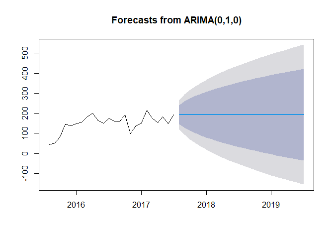

Assignment 5
================
2024-02-24

## The Data

For assignment 5, you will be looking at the [Hotel booking
demand](https://www.kaggle.com/datasets/jessemostipak/hotel-booking-demand)
from Kaggle (csv attached for convince). This data set contains booking
information from two hotels in Prague, “Resort Hotel” and “City Hotel.”

``` r
library(tidyverse)
```

    ## ── Attaching core tidyverse packages ──────────────────────── tidyverse 2.0.0 ──
    ## ✔ dplyr     1.1.2     ✔ readr     2.1.4
    ## ✔ forcats   1.0.0     ✔ stringr   1.5.0
    ## ✔ ggplot2   3.4.4     ✔ tibble    3.2.1
    ## ✔ lubridate 1.9.3     ✔ tidyr     1.3.0
    ## ✔ purrr     1.0.2     
    ## ── Conflicts ────────────────────────────────────────── tidyverse_conflicts() ──
    ## ✖ dplyr::filter() masks stats::filter()
    ## ✖ dplyr::lag()    masks stats::lag()
    ## ℹ Use the conflicted package (<http://conflicted.r-lib.org/>) to force all conflicts to become errors

``` r
library(lubridate)
library(ggplot2)
library(readr)
hotel_bookings <- read_csv("hotel_bookings.csv",
                           col_types = cols(reservation_status_date = col_date(format = "%Y-%m-%d")))

summary(hotel_bookings)
```

    ##     hotel            is_canceled       lead_time   arrival_date_year
    ##  Length:119390      Min.   :0.0000   Min.   :  0   Min.   :2015     
    ##  Class :character   1st Qu.:0.0000   1st Qu.: 18   1st Qu.:2016     
    ##  Mode  :character   Median :0.0000   Median : 69   Median :2016     
    ##                     Mean   :0.3704   Mean   :104   Mean   :2016     
    ##                     3rd Qu.:1.0000   3rd Qu.:160   3rd Qu.:2017     
    ##                     Max.   :1.0000   Max.   :737   Max.   :2017     
    ##                                                                     
    ##  arrival_date_month arrival_date_week_number arrival_date_day_of_month
    ##  Length:119390      Min.   : 1.00            Min.   : 1.0             
    ##  Class :character   1st Qu.:16.00            1st Qu.: 8.0             
    ##  Mode  :character   Median :28.00            Median :16.0             
    ##                     Mean   :27.17            Mean   :15.8             
    ##                     3rd Qu.:38.00            3rd Qu.:23.0             
    ##                     Max.   :53.00            Max.   :31.0             
    ##                                                                       
    ##  stays_in_weekend_nights stays_in_week_nights     adults      
    ##  Min.   : 0.0000         Min.   : 0.0         Min.   : 0.000  
    ##  1st Qu.: 0.0000         1st Qu.: 1.0         1st Qu.: 2.000  
    ##  Median : 1.0000         Median : 2.0         Median : 2.000  
    ##  Mean   : 0.9276         Mean   : 2.5         Mean   : 1.856  
    ##  3rd Qu.: 2.0000         3rd Qu.: 3.0         3rd Qu.: 2.000  
    ##  Max.   :19.0000         Max.   :50.0         Max.   :55.000  
    ##                                                               
    ##     children           babies              meal             country         
    ##  Min.   : 0.0000   Min.   : 0.000000   Length:119390      Length:119390     
    ##  1st Qu.: 0.0000   1st Qu.: 0.000000   Class :character   Class :character  
    ##  Median : 0.0000   Median : 0.000000   Mode  :character   Mode  :character  
    ##  Mean   : 0.1039   Mean   : 0.007949                                        
    ##  3rd Qu.: 0.0000   3rd Qu.: 0.000000                                        
    ##  Max.   :10.0000   Max.   :10.000000                                        
    ##  NA's   :4                                                                  
    ##  market_segment     distribution_channel is_repeated_guest
    ##  Length:119390      Length:119390        Min.   :0.00000  
    ##  Class :character   Class :character     1st Qu.:0.00000  
    ##  Mode  :character   Mode  :character     Median :0.00000  
    ##                                          Mean   :0.03191  
    ##                                          3rd Qu.:0.00000  
    ##                                          Max.   :1.00000  
    ##                                                           
    ##  previous_cancellations previous_bookings_not_canceled reserved_room_type
    ##  Min.   : 0.00000       Min.   : 0.0000                Length:119390     
    ##  1st Qu.: 0.00000       1st Qu.: 0.0000                Class :character  
    ##  Median : 0.00000       Median : 0.0000                Mode  :character  
    ##  Mean   : 0.08712       Mean   : 0.1371                                  
    ##  3rd Qu.: 0.00000       3rd Qu.: 0.0000                                  
    ##  Max.   :26.00000       Max.   :72.0000                                  
    ##                                                                          
    ##  assigned_room_type booking_changes   deposit_type          agent          
    ##  Length:119390      Min.   : 0.0000   Length:119390      Length:119390     
    ##  Class :character   1st Qu.: 0.0000   Class :character   Class :character  
    ##  Mode  :character   Median : 0.0000   Mode  :character   Mode  :character  
    ##                     Mean   : 0.2211                                        
    ##                     3rd Qu.: 0.0000                                        
    ##                     Max.   :21.0000                                        
    ##                                                                            
    ##    company          days_in_waiting_list customer_type           adr         
    ##  Length:119390      Min.   :  0.000      Length:119390      Min.   :  -6.38  
    ##  Class :character   1st Qu.:  0.000      Class :character   1st Qu.:  69.29  
    ##  Mode  :character   Median :  0.000      Mode  :character   Median :  94.58  
    ##                     Mean   :  2.321                         Mean   : 101.83  
    ##                     3rd Qu.:  0.000                         3rd Qu.: 126.00  
    ##                     Max.   :391.000                         Max.   :5400.00  
    ##                                                                              
    ##  required_car_parking_spaces total_of_special_requests reservation_status
    ##  Min.   :0.00000             Min.   :0.0000            Length:119390     
    ##  1st Qu.:0.00000             1st Qu.:0.0000            Class :character  
    ##  Median :0.00000             Median :0.0000            Mode  :character  
    ##  Mean   :0.06252             Mean   :0.5714                              
    ##  3rd Qu.:0.00000             3rd Qu.:1.0000                              
    ##  Max.   :8.00000             Max.   :5.0000                              
    ##                                                                          
    ##  reservation_status_date
    ##  Min.   :2014-10-17     
    ##  1st Qu.:2016-02-01     
    ##  Median :2016-08-07     
    ##  Mean   :2016-07-30     
    ##  3rd Qu.:2017-02-08     
    ##  Max.   :2017-09-14     
    ## 

``` r
str(hotel_bookings)
```

    ## spc_tbl_ [119,390 × 32] (S3: spec_tbl_df/tbl_df/tbl/data.frame)
    ##  $ hotel                         : chr [1:119390] "Resort Hotel" "Resort Hotel" "Resort Hotel" "Resort Hotel" ...
    ##  $ is_canceled                   : num [1:119390] 0 0 0 0 0 0 0 0 1 1 ...
    ##  $ lead_time                     : num [1:119390] 342 737 7 13 14 14 0 9 85 75 ...
    ##  $ arrival_date_year             : num [1:119390] 2015 2015 2015 2015 2015 ...
    ##  $ arrival_date_month            : chr [1:119390] "July" "July" "July" "July" ...
    ##  $ arrival_date_week_number      : num [1:119390] 27 27 27 27 27 27 27 27 27 27 ...
    ##  $ arrival_date_day_of_month     : num [1:119390] 1 1 1 1 1 1 1 1 1 1 ...
    ##  $ stays_in_weekend_nights       : num [1:119390] 0 0 0 0 0 0 0 0 0 0 ...
    ##  $ stays_in_week_nights          : num [1:119390] 0 0 1 1 2 2 2 2 3 3 ...
    ##  $ adults                        : num [1:119390] 2 2 1 1 2 2 2 2 2 2 ...
    ##  $ children                      : num [1:119390] 0 0 0 0 0 0 0 0 0 0 ...
    ##  $ babies                        : num [1:119390] 0 0 0 0 0 0 0 0 0 0 ...
    ##  $ meal                          : chr [1:119390] "BB" "BB" "BB" "BB" ...
    ##  $ country                       : chr [1:119390] "PRT" "PRT" "GBR" "GBR" ...
    ##  $ market_segment                : chr [1:119390] "Direct" "Direct" "Direct" "Corporate" ...
    ##  $ distribution_channel          : chr [1:119390] "Direct" "Direct" "Direct" "Corporate" ...
    ##  $ is_repeated_guest             : num [1:119390] 0 0 0 0 0 0 0 0 0 0 ...
    ##  $ previous_cancellations        : num [1:119390] 0 0 0 0 0 0 0 0 0 0 ...
    ##  $ previous_bookings_not_canceled: num [1:119390] 0 0 0 0 0 0 0 0 0 0 ...
    ##  $ reserved_room_type            : chr [1:119390] "C" "C" "A" "A" ...
    ##  $ assigned_room_type            : chr [1:119390] "C" "C" "C" "A" ...
    ##  $ booking_changes               : num [1:119390] 3 4 0 0 0 0 0 0 0 0 ...
    ##  $ deposit_type                  : chr [1:119390] "No Deposit" "No Deposit" "No Deposit" "No Deposit" ...
    ##  $ agent                         : chr [1:119390] "NULL" "NULL" "NULL" "304" ...
    ##  $ company                       : chr [1:119390] "NULL" "NULL" "NULL" "NULL" ...
    ##  $ days_in_waiting_list          : num [1:119390] 0 0 0 0 0 0 0 0 0 0 ...
    ##  $ customer_type                 : chr [1:119390] "Transient" "Transient" "Transient" "Transient" ...
    ##  $ adr                           : num [1:119390] 0 0 75 75 98 ...
    ##  $ required_car_parking_spaces   : num [1:119390] 0 0 0 0 0 0 0 0 0 0 ...
    ##  $ total_of_special_requests     : num [1:119390] 0 0 0 0 1 1 0 1 1 0 ...
    ##  $ reservation_status            : chr [1:119390] "Check-Out" "Check-Out" "Check-Out" "Check-Out" ...
    ##  $ reservation_status_date       : Date[1:119390], format: "2015-07-01" "2015-07-01" ...
    ##  - attr(*, "spec")=
    ##   .. cols(
    ##   ..   hotel = col_character(),
    ##   ..   is_canceled = col_double(),
    ##   ..   lead_time = col_double(),
    ##   ..   arrival_date_year = col_double(),
    ##   ..   arrival_date_month = col_character(),
    ##   ..   arrival_date_week_number = col_double(),
    ##   ..   arrival_date_day_of_month = col_double(),
    ##   ..   stays_in_weekend_nights = col_double(),
    ##   ..   stays_in_week_nights = col_double(),
    ##   ..   adults = col_double(),
    ##   ..   children = col_double(),
    ##   ..   babies = col_double(),
    ##   ..   meal = col_character(),
    ##   ..   country = col_character(),
    ##   ..   market_segment = col_character(),
    ##   ..   distribution_channel = col_character(),
    ##   ..   is_repeated_guest = col_double(),
    ##   ..   previous_cancellations = col_double(),
    ##   ..   previous_bookings_not_canceled = col_double(),
    ##   ..   reserved_room_type = col_character(),
    ##   ..   assigned_room_type = col_character(),
    ##   ..   booking_changes = col_double(),
    ##   ..   deposit_type = col_character(),
    ##   ..   agent = col_character(),
    ##   ..   company = col_character(),
    ##   ..   days_in_waiting_list = col_double(),
    ##   ..   customer_type = col_character(),
    ##   ..   adr = col_double(),
    ##   ..   required_car_parking_spaces = col_double(),
    ##   ..   total_of_special_requests = col_double(),
    ##   ..   reservation_status = col_character(),
    ##   ..   reservation_status_date = col_date(format = "%Y-%m-%d")
    ##   .. )
    ##  - attr(*, "problems")=<externalptr>

``` r
hotel_bookings <- read_csv("hotel_bookings.csv",
                           col_types = cols(reservation_status_date = col_date(format = "%Y-%m-%d")))

summary(hotel_bookings)
```

    ##     hotel            is_canceled       lead_time   arrival_date_year
    ##  Length:119390      Min.   :0.0000   Min.   :  0   Min.   :2015     
    ##  Class :character   1st Qu.:0.0000   1st Qu.: 18   1st Qu.:2016     
    ##  Mode  :character   Median :0.0000   Median : 69   Median :2016     
    ##                     Mean   :0.3704   Mean   :104   Mean   :2016     
    ##                     3rd Qu.:1.0000   3rd Qu.:160   3rd Qu.:2017     
    ##                     Max.   :1.0000   Max.   :737   Max.   :2017     
    ##                                                                     
    ##  arrival_date_month arrival_date_week_number arrival_date_day_of_month
    ##  Length:119390      Min.   : 1.00            Min.   : 1.0             
    ##  Class :character   1st Qu.:16.00            1st Qu.: 8.0             
    ##  Mode  :character   Median :28.00            Median :16.0             
    ##                     Mean   :27.17            Mean   :15.8             
    ##                     3rd Qu.:38.00            3rd Qu.:23.0             
    ##                     Max.   :53.00            Max.   :31.0             
    ##                                                                       
    ##  stays_in_weekend_nights stays_in_week_nights     adults      
    ##  Min.   : 0.0000         Min.   : 0.0         Min.   : 0.000  
    ##  1st Qu.: 0.0000         1st Qu.: 1.0         1st Qu.: 2.000  
    ##  Median : 1.0000         Median : 2.0         Median : 2.000  
    ##  Mean   : 0.9276         Mean   : 2.5         Mean   : 1.856  
    ##  3rd Qu.: 2.0000         3rd Qu.: 3.0         3rd Qu.: 2.000  
    ##  Max.   :19.0000         Max.   :50.0         Max.   :55.000  
    ##                                                               
    ##     children           babies              meal             country         
    ##  Min.   : 0.0000   Min.   : 0.000000   Length:119390      Length:119390     
    ##  1st Qu.: 0.0000   1st Qu.: 0.000000   Class :character   Class :character  
    ##  Median : 0.0000   Median : 0.000000   Mode  :character   Mode  :character  
    ##  Mean   : 0.1039   Mean   : 0.007949                                        
    ##  3rd Qu.: 0.0000   3rd Qu.: 0.000000                                        
    ##  Max.   :10.0000   Max.   :10.000000                                        
    ##  NA's   :4                                                                  
    ##  market_segment     distribution_channel is_repeated_guest
    ##  Length:119390      Length:119390        Min.   :0.00000  
    ##  Class :character   Class :character     1st Qu.:0.00000  
    ##  Mode  :character   Mode  :character     Median :0.00000  
    ##                                          Mean   :0.03191  
    ##                                          3rd Qu.:0.00000  
    ##                                          Max.   :1.00000  
    ##                                                           
    ##  previous_cancellations previous_bookings_not_canceled reserved_room_type
    ##  Min.   : 0.00000       Min.   : 0.0000                Length:119390     
    ##  1st Qu.: 0.00000       1st Qu.: 0.0000                Class :character  
    ##  Median : 0.00000       Median : 0.0000                Mode  :character  
    ##  Mean   : 0.08712       Mean   : 0.1371                                  
    ##  3rd Qu.: 0.00000       3rd Qu.: 0.0000                                  
    ##  Max.   :26.00000       Max.   :72.0000                                  
    ##                                                                          
    ##  assigned_room_type booking_changes   deposit_type          agent          
    ##  Length:119390      Min.   : 0.0000   Length:119390      Length:119390     
    ##  Class :character   1st Qu.: 0.0000   Class :character   Class :character  
    ##  Mode  :character   Median : 0.0000   Mode  :character   Mode  :character  
    ##                     Mean   : 0.2211                                        
    ##                     3rd Qu.: 0.0000                                        
    ##                     Max.   :21.0000                                        
    ##                                                                            
    ##    company          days_in_waiting_list customer_type           adr         
    ##  Length:119390      Min.   :  0.000      Length:119390      Min.   :  -6.38  
    ##  Class :character   1st Qu.:  0.000      Class :character   1st Qu.:  69.29  
    ##  Mode  :character   Median :  0.000      Mode  :character   Median :  94.58  
    ##                     Mean   :  2.321                         Mean   : 101.83  
    ##                     3rd Qu.:  0.000                         3rd Qu.: 126.00  
    ##                     Max.   :391.000                         Max.   :5400.00  
    ##                                                                              
    ##  required_car_parking_spaces total_of_special_requests reservation_status
    ##  Min.   :0.00000             Min.   :0.0000            Length:119390     
    ##  1st Qu.:0.00000             1st Qu.:0.0000            Class :character  
    ##  Median :0.00000             Median :0.0000            Mode  :character  
    ##  Mean   :0.06252             Mean   :0.5714                              
    ##  3rd Qu.:0.00000             3rd Qu.:1.0000                              
    ##  Max.   :8.00000             Max.   :5.0000                              
    ##                                                                          
    ##  reservation_status_date
    ##  Min.   :2014-10-17     
    ##  1st Qu.:2016-02-01     
    ##  Median :2016-08-07     
    ##  Mean   :2016-07-30     
    ##  3rd Qu.:2017-02-08     
    ##  Max.   :2017-09-14     
    ## 

``` r
str(hotel_bookings)
```

    ## spc_tbl_ [119,390 × 32] (S3: spec_tbl_df/tbl_df/tbl/data.frame)
    ##  $ hotel                         : chr [1:119390] "Resort Hotel" "Resort Hotel" "Resort Hotel" "Resort Hotel" ...
    ##  $ is_canceled                   : num [1:119390] 0 0 0 0 0 0 0 0 1 1 ...
    ##  $ lead_time                     : num [1:119390] 342 737 7 13 14 14 0 9 85 75 ...
    ##  $ arrival_date_year             : num [1:119390] 2015 2015 2015 2015 2015 ...
    ##  $ arrival_date_month            : chr [1:119390] "July" "July" "July" "July" ...
    ##  $ arrival_date_week_number      : num [1:119390] 27 27 27 27 27 27 27 27 27 27 ...
    ##  $ arrival_date_day_of_month     : num [1:119390] 1 1 1 1 1 1 1 1 1 1 ...
    ##  $ stays_in_weekend_nights       : num [1:119390] 0 0 0 0 0 0 0 0 0 0 ...
    ##  $ stays_in_week_nights          : num [1:119390] 0 0 1 1 2 2 2 2 3 3 ...
    ##  $ adults                        : num [1:119390] 2 2 1 1 2 2 2 2 2 2 ...
    ##  $ children                      : num [1:119390] 0 0 0 0 0 0 0 0 0 0 ...
    ##  $ babies                        : num [1:119390] 0 0 0 0 0 0 0 0 0 0 ...
    ##  $ meal                          : chr [1:119390] "BB" "BB" "BB" "BB" ...
    ##  $ country                       : chr [1:119390] "PRT" "PRT" "GBR" "GBR" ...
    ##  $ market_segment                : chr [1:119390] "Direct" "Direct" "Direct" "Corporate" ...
    ##  $ distribution_channel          : chr [1:119390] "Direct" "Direct" "Direct" "Corporate" ...
    ##  $ is_repeated_guest             : num [1:119390] 0 0 0 0 0 0 0 0 0 0 ...
    ##  $ previous_cancellations        : num [1:119390] 0 0 0 0 0 0 0 0 0 0 ...
    ##  $ previous_bookings_not_canceled: num [1:119390] 0 0 0 0 0 0 0 0 0 0 ...
    ##  $ reserved_room_type            : chr [1:119390] "C" "C" "A" "A" ...
    ##  $ assigned_room_type            : chr [1:119390] "C" "C" "C" "A" ...
    ##  $ booking_changes               : num [1:119390] 3 4 0 0 0 0 0 0 0 0 ...
    ##  $ deposit_type                  : chr [1:119390] "No Deposit" "No Deposit" "No Deposit" "No Deposit" ...
    ##  $ agent                         : chr [1:119390] "NULL" "NULL" "NULL" "304" ...
    ##  $ company                       : chr [1:119390] "NULL" "NULL" "NULL" "NULL" ...
    ##  $ days_in_waiting_list          : num [1:119390] 0 0 0 0 0 0 0 0 0 0 ...
    ##  $ customer_type                 : chr [1:119390] "Transient" "Transient" "Transient" "Transient" ...
    ##  $ adr                           : num [1:119390] 0 0 75 75 98 ...
    ##  $ required_car_parking_spaces   : num [1:119390] 0 0 0 0 0 0 0 0 0 0 ...
    ##  $ total_of_special_requests     : num [1:119390] 0 0 0 0 1 1 0 1 1 0 ...
    ##  $ reservation_status            : chr [1:119390] "Check-Out" "Check-Out" "Check-Out" "Check-Out" ...
    ##  $ reservation_status_date       : Date[1:119390], format: "2015-07-01" "2015-07-01" ...
    ##  - attr(*, "spec")=
    ##   .. cols(
    ##   ..   hotel = col_character(),
    ##   ..   is_canceled = col_double(),
    ##   ..   lead_time = col_double(),
    ##   ..   arrival_date_year = col_double(),
    ##   ..   arrival_date_month = col_character(),
    ##   ..   arrival_date_week_number = col_double(),
    ##   ..   arrival_date_day_of_month = col_double(),
    ##   ..   stays_in_weekend_nights = col_double(),
    ##   ..   stays_in_week_nights = col_double(),
    ##   ..   adults = col_double(),
    ##   ..   children = col_double(),
    ##   ..   babies = col_double(),
    ##   ..   meal = col_character(),
    ##   ..   country = col_character(),
    ##   ..   market_segment = col_character(),
    ##   ..   distribution_channel = col_character(),
    ##   ..   is_repeated_guest = col_double(),
    ##   ..   previous_cancellations = col_double(),
    ##   ..   previous_bookings_not_canceled = col_double(),
    ##   ..   reserved_room_type = col_character(),
    ##   ..   assigned_room_type = col_character(),
    ##   ..   booking_changes = col_double(),
    ##   ..   deposit_type = col_character(),
    ##   ..   agent = col_character(),
    ##   ..   company = col_character(),
    ##   ..   days_in_waiting_list = col_double(),
    ##   ..   customer_type = col_character(),
    ##   ..   adr = col_double(),
    ##   ..   required_car_parking_spaces = col_double(),
    ##   ..   total_of_special_requests = col_double(),
    ##   ..   reservation_status = col_character(),
    ##   ..   reservation_status_date = col_date(format = "%Y-%m-%d")
    ##   .. )
    ##  - attr(*, "problems")=<externalptr>

``` r
library(lubridate)

# Clean data set
myHotel_bookings<-hotel_bookings%>%
  mutate(arrival_date=paste0(arrival_date_day_of_month,
                             arrival_date_month,
                             arrival_date_year)%>%
           dmy(),
         arrival_status_diff=arrival_date-reservation_status_date,
         reservation_status_date_month=month(reservation_status_date),
         reservation_status_date_year=year(reservation_status_date),
         arrival_date_month_num=month(arrival_date))%>% # clean dates
  mutate(hotel=as.factor(hotel),
         meal = as.factor(meal),
         country = as.factor(country),
         market_segment = as.factor(market_segment),
         distribution_channel = as.factor(distribution_channel),
         reserved_room_type = as.factor(reserved_room_type),
         assigned_room_type = as.factor(assigned_room_type),
         deposit_type = as.factor(deposit_type),
         agent = as.factor(agent),
         company = as.factor(company),
         reservation_status = as.factor(reservation_status),
         customer_type =as.factor(customer_type))%>% # convert character variables to factors
    mutate(reservation_date = arrival_date -ddays(lead_time),
         is_LMC = as.numeric(is_canceled==1 & arrival_status_diff<=30)) # engineer new variables


# Find LMCs by month
myHotel_LMCs<-myHotel_bookings%>%
  filter(is_LMC==1)%>% # select only LMCs
  group_by(hotel, reservation_status_date_year,reservation_status_date_month)%>%
  summarise(cancelations=sum(is_LMC))%>% # get total LMCs by month, year, and hotel
  arrange(hotel, reservation_status_date_year,reservation_status_date_month) # sort the data
```

    ## `summarise()` has grouped output by 'hotel', 'reservation_status_date_year'.
    ## You can override using the `.groups` argument.

``` r
myHotel_bookings_completed_Jul17 <- myHotel_bookings%>%
  filter(reservation_status_date<ymd("20170701") | arrival_date<ymd("20170701"))

myHotel_bookings_outstanding_Jul17 <- myHotel_bookings%>%
  filter(reservation_status_date>=ymd("20170701") &
           arrival_date>=ymd("20170701") &
           reservation_date<ymd("20170701"))%>%
  select(-is_canceled,
         -reservation_status,
         -reservation_status_date,
         -reservation_status_date_month,
         -reservation_status_date_year,
         -arrival_status_diff,
         -assigned_room_type)

myHotel_bookings_completed_Aug17 <- myHotel_bookings%>%
  filter(reservation_status_date<ymd("20170801") | arrival_date<ymd("20170801"))

myHotel_bookings_outstanding_Aug17 <- myHotel_bookings%>%
  filter(reservation_status_date>=ymd("20170801") &
           arrival_date>=ymd("20170801") &
           reservation_date<ymd("20170801"))%>%
  select(is_canceled,
         
         -reservation_status,
         -reservation_status_date,
         -reservation_status_date_month,
         -reservation_status_date_year,
         -arrival_status_diff,
         -assigned_room_type)
```

Note that ‘completed’ data sets are used for model training, and
‘outstanding’ are used for forecasting.

``` r
library(forecast)
```

    ## Warning: package 'forecast' was built under R version 4.3.2

    ## Registered S3 method overwritten by 'quantmod':
    ##   method            from
    ##   as.zoo.data.frame zoo

``` r
# July 2017

# Summarize the data
summary_completed_Jul17 <- myHotel_bookings_completed_Jul17%>%
  group_by(reservation_status_date_year,reservation_status_date_month)%>% # we should be forecasting on 'reservation_status_date' since that is the date the actual cancellation occurred. That is my bad.
  filter(reservation_status_date<ymd("20170701"))%>% # We made the assumption that once a guest checks in, their stay will be fine. That gives us some weird data on the edge for guests who have already checked in but are still in the hotel. We should filter out those guests.
  filter(reservation_date>=ymd("20150701"))%>% # along the same vein, the data set starts with check in dates in 7/2015 but some of these canceled way ahead of time giving us some data issues. We should filter out those guests.
  filter(hotel=="Resort Hotel")%>% # don't forget we work for Resort Hotel (if you are clever you can figure out how to use the City Hotel data to help you, but I'm not giving this one away)
  summarise(LMCs = sum(is_LMC), total_bookings = n()) # LMCs is our target. We will use 'total_bookings' as an external predictor. This isn't a great way to do this, since some of these bookings were past the time we would have hypothetically had data availiable forecasting. There is a better way, but I'm not giving it away.
```

    ## `summarise()` has grouped output by 'reservation_status_date_year'. You can
    ## override using the `.groups` argument.

``` r
# Convert target into time series
summary_completed_Jul17_TS = ts(summary_completed_Jul17$LMCs, start=c(2015,7), frequency=12)
```

Last minute cancellations (LMCs) are when a guest cancels their
reservations on very short notice (for this assignment we will say less
than or equal to 30 days before their check-in date). They are a
logistical nightmare for the hotel industry, because staffing, stocking,
etc. all depend on the number of guest staying in the hotel.

Let’s do some basic data cleaning and take a look at the LMCs for each
hotel:

``` r
# Clean data set
myHotel_bookings<-hotel_bookings%>%
  mutate(arrival_date=paste0(arrival_date_day_of_month,
                             arrival_date_month,
                             arrival_date_year)%>%
           dmy(),
         arrival_status_diff=arrival_date-reservation_status_date,
         reservation_status_date_month=month(reservation_status_date),
         reservation_status_date_year=year(reservation_status_date),
         arrival_date_month_num=month(arrival_date))%>% # clean dates
  mutate(hotel=as.factor(hotel),
         meal = as.factor(meal),
         country = as.factor(country),
         market_segment = as.factor(market_segment),
         distribution_channel = as.factor(distribution_channel),
         reserved_room_type = as.factor(reserved_room_type),
         assigned_room_type = as.factor(assigned_room_type),
         deposit_type = as.factor(deposit_type),
         agent = as.factor(agent),
         company = as.factor(company),
         reservation_status = as.factor(reservation_status),
         customer_type =as.factor(customer_type))%>% # convert character variables to factors
    mutate(reservation_date = arrival_date -ddays(lead_time),
         is_LMC = as.numeric(is_canceled==1 & arrival_status_diff<=30)) # engineer new variables


# Find LMCs by month
myHotel_LMCs<-myHotel_bookings%>%
  filter(is_LMC==1)%>% # select only LMCs
  group_by(hotel, reservation_status_date_year,reservation_status_date_month)%>%
  summarise(cancelations=sum(is_LMC))%>% # get total LMCs by month, year, and hotel
  arrange(hotel, reservation_status_date_year,reservation_status_date_month) # sort the data
```

    ## `summarise()` has grouped output by 'hotel', 'reservation_status_date_year'.
    ## You can override using the `.groups` argument.

``` r
print(myHotel_LMCs)
```

    ## # A tibble: 54 × 4
    ## # Groups:   hotel, reservation_status_date_year [6]
    ##    hotel      reservation_status_date_year reservation_status_dat…¹ cancelations
    ##    <fct>                             <dbl>                    <dbl>        <dbl>
    ##  1 City Hotel                         2015                        6          188
    ##  2 City Hotel                         2015                        7          453
    ##  3 City Hotel                         2015                        8          359
    ##  4 City Hotel                         2015                        9          676
    ##  5 City Hotel                         2015                       10          381
    ##  6 City Hotel                         2015                       11          369
    ##  7 City Hotel                         2015                       12          152
    ##  8 City Hotel                         2016                        1          281
    ##  9 City Hotel                         2016                        2          494
    ## 10 City Hotel                         2016                        3          535
    ## # ℹ 44 more rows
    ## # ℹ abbreviated name: ¹​reservation_status_date_month

## The Assignment

For this assignment, you will assume the role of an analyst for “Resort
Hotel.” In this position, at the end of each month you must submit a
forecast of the expect number of LMCs for the next month.

Specifically, you must:

- Pretending the date is is June 30th, 2017 (i.e. you only have access
  to data up to June 30th, 2017), create a forecast for the number of
  LMCs at “Resort Hotel” for July 2017.
- Pretending the date is is July 31st, 2017 (i.e. you only have access
  to data up to July 31st, 2017), create a forecast for the number of
  LMCs at “Resort Hotel” for August 2017.

To help from accidentally building models with leakage I have
pre-cleaned some data sets for you:

``` r
myHotel_bookings_completed_Jul17 <- myHotel_bookings%>%
  filter(reservation_status_date<ymd("20170701") | arrival_date<ymd("20170701"))

myHotel_bookings_outstanding_Jul17 <- myHotel_bookings%>%
  filter(reservation_status_date>=ymd("20170701") &
           arrival_date>=ymd("20170701") &
           reservation_date<ymd("20170701"))%>%
  select(-is_canceled,
         -reservation_status,
         -reservation_status_date,
         -reservation_status_date_month,
         -reservation_status_date_year,
         -arrival_status_diff,
         -assigned_room_type)

myHotel_bookings_completed_Aug17 <- myHotel_bookings%>%
  filter(reservation_status_date<ymd("20170801") | arrival_date<ymd("20170801"))

myHotel_bookings_outstanding_Aug17 <- myHotel_bookings%>%
  filter(reservation_status_date>=ymd("20170801") &
           arrival_date>=ymd("20170801") &
           reservation_date<ymd("20170801"))%>%
  select(-is_canceled,
         
         -reservation_status,
         -reservation_status_date,
         -reservation_status_date_month,
         -reservation_status_date_year,
         -arrival_status_diff,
         -assigned_room_type)
```

You must only use:

- `myHotel_bookings_completed_Jul17` to train the July 2017 model
- `myHotel_bookings_completed_Aug17` to train the August 2017 model
- `myHotel_bookings_outstanding_Jul17` as external predictor values for
  the July 2017 model
- `myHotel_bookings_outstanding_Aug17` as external predictor values for
  the August 2017 model.

## Additional Rules

In addition to only using the time-appropriate data as specified in the
previous section you must also follow these rules:

- You must use the same methodology for the July 2017 and August 2017
  models.
- You must only use `gam`, `prophet`, and `auto.arima` (with or without
  external regressors) models.
- You must try at least two modeling methodologies and submit the code
  for them (i.e. a `gam` and a `prophet` model is acceptable but two
  `auto,arima` models is not).
- You must explain your process including why you made any decisions you
  made, what your code is doing, etc.
- Your decisions/ models/ etc. must be defensible without reference to
  data you would not have access to on the hypothetical date of your
  analysis.
- You may use “City Hotel” data to help you construct your model, but be
  careful not to accidentally include it in your final forecast.

## Evaluation

We know the true value for July 2017 is `193` and the correct value for
August 2017 is `135`. Given this information, I have created the
following function to calculate RMSE for your models.

``` r
modelTester <- function(for1707,for1708){
  return(sqrt((((for1707-193)^2+(for1708-135)^2))/2))
}
```

Recall, lower RMSE is desirable or “better.”

# Assignment 5

## EDA

``` r
summary(myHotel_bookings_completed_Aug17)
```

    ##           hotel        is_canceled       lead_time     arrival_date_year
    ##  City Hotel  :77143   Min.   :0.0000   Min.   :  0.0   Min.   :2015     
    ##  Resort Hotel:38818   1st Qu.:0.0000   1st Qu.: 18.0   1st Qu.:2016     
    ##                       Median :0.0000   Median : 69.0   Median :2016     
    ##                       Mean   :0.3786   Mean   :103.3   Mean   :2016     
    ##                       3rd Qu.:1.0000   3rd Qu.:159.0   3rd Qu.:2017     
    ##                       Max.   :1.0000   Max.   :737.0   Max.   :2017     
    ##                                                                         
    ##  arrival_date_month arrival_date_week_number arrival_date_day_of_month
    ##  Length:115961      Min.   : 1.00            Min.   : 1.00            
    ##  Class :character   1st Qu.:16.00            1st Qu.: 8.00            
    ##  Mode  :character   Median :27.00            Median :16.00            
    ##                     Mean   :26.99            Mean   :15.78            
    ##                     3rd Qu.:39.00            3rd Qu.:23.00            
    ##                     Max.   :53.00            Max.   :31.00            
    ##                                                                       
    ##  stays_in_weekend_nights stays_in_week_nights     adults      
    ##  Min.   : 0.0000         Min.   : 0.000       Min.   : 0.000  
    ##  1st Qu.: 0.0000         1st Qu.: 1.000       1st Qu.: 2.000  
    ##  Median : 1.0000         Median : 2.000       Median : 2.000  
    ##  Mean   : 0.9244         Mean   : 2.491       Mean   : 1.853  
    ##  3rd Qu.: 2.0000         3rd Qu.: 3.000       3rd Qu.: 2.000  
    ##  Max.   :19.0000         Max.   :50.000       Max.   :55.000  
    ##                                                               
    ##     children           babies                 meal          country     
    ##  Min.   : 0.0000   Min.   : 0.000000   BB       :89997   PRT    :47703  
    ##  1st Qu.: 0.0000   1st Qu.: 0.000000   FB       :  768   GBR    :11673  
    ##  Median : 0.0000   Median : 0.000000   HB       :13814   FRA    :10064  
    ##  Mean   : 0.1001   Mean   : 0.007813   SC       :10232   ESP    : 8202  
    ##  3rd Qu.: 0.0000   3rd Qu.: 0.000000   Undefined: 1150   DEU    : 6985  
    ##  Max.   :10.0000   Max.   :10.000000                     ITA    : 3657  
    ##  NA's   :4                                               (Other):27677  
    ##        market_segment  distribution_channel is_repeated_guest
    ##  Online TA    :54515   Corporate: 6612      Min.   :0.00000  
    ##  Offline TA/TO:23553   Direct   :14052      1st Qu.:0.00000  
    ##  Groups       :19670   GDS      :  191      Median :0.00000  
    ##  Direct       :12019   TA/TO    :95101      Mean   :0.03199  
    ##  Corporate    : 5235   Undefined:    5      3rd Qu.:0.00000  
    ##  Complementary:  731                        Max.   :1.00000  
    ##  (Other)      :  238                                         
    ##  previous_cancellations previous_bookings_not_canceled reserved_room_type
    ##  Min.   : 0.0000        Min.   : 0.0000                A      :83988     
    ##  1st Qu.: 0.0000        1st Qu.: 0.0000                D      :18382     
    ##  Median : 0.0000        Median : 0.0000                E      : 6290     
    ##  Mean   : 0.0893        Mean   : 0.1366                F      : 2764     
    ##  3rd Qu.: 0.0000        3rd Qu.: 0.0000                G      : 2000     
    ##  Max.   :26.0000        Max.   :71.0000                B      : 1096     
    ##                                                        (Other): 1441     
    ##  assigned_room_type booking_changes       deposit_type        agent      
    ##  A      :72176      Min.   : 0.0000   No Deposit:101236   9      :30934  
    ##  D      :24485      1st Qu.: 0.0000   Non Refund: 14565   NULL   :16088  
    ##  E      : 7545      Median : 0.0000   Refundable:   160   240    :13503  
    ##  F      : 3595      Mean   : 0.2159                       1      : 7191  
    ##  G      : 2446      3rd Qu.: 0.0000                       7      : 3426  
    ##  C      : 2269      Max.   :21.0000                       14     : 3410  
    ##  (Other): 3445                                            (Other):41409  
    ##     company       days_in_waiting_list         customer_type  
    ##  NULL   :109237   Min.   :  0.00       Contract       : 3972  
    ##  40     :   898   1st Qu.:  0.00       Group          :  544  
    ##  223    :   784   Median :  0.00       Transient      :86882  
    ##  67     :   267   Mean   :  2.39       Transient-Party:24563  
    ##  45     :   246   3rd Qu.:  0.00                              
    ##  153    :   214   Max.   :391.00                              
    ##  (Other):  4315                                               
    ##       adr          required_car_parking_spaces total_of_special_requests
    ##  Min.   :  -6.38   Min.   :0.00000             Min.   :0.0000           
    ##  1st Qu.:  68.00   1st Qu.:0.00000             1st Qu.:0.0000           
    ##  Median :  93.00   Median :0.00000             Median :0.0000           
    ##  Mean   : 100.08   Mean   :0.06177             Mean   :0.5572           
    ##  3rd Qu.: 123.75   3rd Qu.:0.00000             3rd Qu.:1.0000           
    ##  Max.   :5400.00   Max.   :8.00000             Max.   :5.0000           
    ##                                                                         
    ##  reservation_status reservation_status_date  arrival_date       
    ##  Canceled :42730    Min.   :2014-10-17      Min.   :2015-07-01  
    ##  Check-Out:72057    1st Qu.:2016-01-26      1st Qu.:2016-03-07  
    ##  No-Show  : 1174    Median :2016-07-26      Median :2016-08-26  
    ##                     Mean   :2016-07-18      Mean   :2016-08-18  
    ##                     3rd Qu.:2017-01-25      3rd Qu.:2017-03-02  
    ##                     Max.   :2017-08-23      Max.   :2017-08-31  
    ##                                                                 
    ##  arrival_status_diff reservation_status_date_month reservation_status_date_year
    ##  Length:115961       Min.   : 1.000                Min.   :2014                
    ##  Class :difftime     1st Qu.: 3.000                1st Qu.:2016                
    ##  Mode  :numeric      Median : 6.000                Median :2016                
    ##                      Mean   : 6.281                Mean   :2016                
    ##                      3rd Qu.: 9.000                3rd Qu.:2017                
    ##                      Max.   :12.000                Max.   :2017                
    ##                                                                                
    ##  arrival_date_month_num reservation_date         is_LMC      
    ##  Min.   : 1.00          Min.   :2013-06-24   Min.   :0.0000  
    ##  1st Qu.: 4.00          1st Qu.:2015-11-20   1st Qu.:0.0000  
    ##  Median : 7.00          Median :2016-04-21   Median :0.0000  
    ##  Mean   : 6.51          Mean   :2016-05-06   Mean   :0.1327  
    ##  3rd Qu.: 9.00          3rd Qu.:2016-11-27   3rd Qu.:0.0000  
    ##  Max.   :12.00          Max.   :2017-07-31   Max.   :1.0000  
    ## 

``` r
summary(myHotel_bookings_completed_Jul17)
```

    ##           hotel        is_canceled      lead_time     arrival_date_year
    ##  City Hotel  :74468   Min.   :0.000   Min.   :  0.0   Min.   :2015     
    ##  Resort Hotel:37462   1st Qu.:0.000   1st Qu.: 18.0   1st Qu.:2016     
    ##                       Median :0.000   Median : 68.0   Median :2016     
    ##                       Mean   :0.386   Mean   :102.2   Mean   :2016     
    ##                       3rd Qu.:1.000   3rd Qu.:157.0   3rd Qu.:2017     
    ##                       Max.   :1.000   Max.   :737.0   Max.   :2017     
    ##                                                                        
    ##  arrival_date_month arrival_date_week_number arrival_date_day_of_month
    ##  Length:111930      Min.   : 1.00            Min.   : 1.00            
    ##  Class :character   1st Qu.:15.00            1st Qu.: 8.00            
    ##  Mode  :character   Median :26.00            Median :16.00            
    ##                     Mean   :26.92            Mean   :15.78            
    ##                     3rd Qu.:39.00            3rd Qu.:23.00            
    ##                     Max.   :53.00            Max.   :31.00            
    ##                                                                       
    ##  stays_in_weekend_nights stays_in_week_nights     adults      
    ##  Min.   : 0.0000         Min.   : 0.000       Min.   : 0.000  
    ##  1st Qu.: 0.0000         1st Qu.: 1.000       1st Qu.: 2.000  
    ##  Median : 1.0000         Median : 2.000       Median : 2.000  
    ##  Mean   : 0.9188         Mean   : 2.486       Mean   : 1.848  
    ##  3rd Qu.: 2.0000         3rd Qu.: 3.000       3rd Qu.: 2.000  
    ##  Max.   :19.0000         Max.   :50.000       Max.   :55.000  
    ##                                                               
    ##     children            babies                 meal          country     
    ##  Min.   : 0.00000   Min.   : 0.000000   BB       :87175   PRT    :46833  
    ##  1st Qu.: 0.00000   1st Qu.: 0.000000   FB       :  757   GBR    :11102  
    ##  Median : 0.00000   Median : 0.000000   HB       :13200   FRA    : 9747  
    ##  Mean   : 0.09611   Mean   : 0.007808   SC       : 9657   ESP    : 7881  
    ##  3rd Qu.: 0.00000   3rd Qu.: 0.000000   Undefined: 1141   DEU    : 6544  
    ##  Max.   :10.00000   Max.   :10.000000                     ITA    : 3579  
    ##  NA's   :4                                                (Other):26244  
    ##        market_segment  distribution_channel is_repeated_guest
    ##  Online TA    :52005   Corporate: 6508      Min.   :0.00000  
    ##  Offline TA/TO:22919   Direct   :13387      1st Qu.:0.00000  
    ##  Groups       :19558   GDS      :  191      Median :0.00000  
    ##  Direct       :11368   TA/TO    :91839      Mean   :0.03216  
    ##  Corporate    : 5133   Undefined:    5      3rd Qu.:0.00000  
    ##  Complementary:  713                        Max.   :1.00000  
    ##  (Other)      :  234                                         
    ##  previous_cancellations previous_bookings_not_canceled reserved_room_type
    ##  Min.   : 0.00000       Min.   : 0.0000                A      :81514     
    ##  1st Qu.: 0.00000       1st Qu.: 0.0000                D      :17509     
    ##  Median : 0.00000       Median : 0.0000                E      : 5990     
    ##  Mean   : 0.09187       Mean   : 0.1334                F      : 2623     
    ##  3rd Qu.: 0.00000       3rd Qu.: 0.0000                G      : 1903     
    ##  Max.   :26.00000       Max.   :67.0000                B      : 1065     
    ##                                                        (Other): 1326     
    ##  assigned_room_type booking_changes       deposit_type       agent      
    ##  A      :69847      Min.   : 0.0000   No Deposit:97227   9      :29546  
    ##  D      :23563      1st Qu.: 0.0000   Non Refund:14553   NULL   :15757  
    ##  E      : 7243      Median : 0.0000   Refundable:  150   240    :12958  
    ##  F      : 3438      Mean   : 0.2131                      1      : 7191  
    ##  G      : 2336      3rd Qu.: 0.0000                      7      : 3297  
    ##  C      : 2148      Max.   :21.0000                      14     : 3133  
    ##  (Other): 3355                                           (Other):40048  
    ##     company       days_in_waiting_list         customer_type  
    ##  NULL   :105316   Min.   :  0.000      Contract       : 3893  
    ##  40     :   856   1st Qu.:  0.000      Group          :  528  
    ##  223    :   784   Median :  0.000      Transient      :83593  
    ##  67     :   267   Mean   :  2.475      Transient-Party:23916  
    ##  45     :   240   3rd Qu.:  0.000                             
    ##  153    :   210   Max.   :391.000                             
    ##  (Other):  4257                                               
    ##       adr          required_car_parking_spaces total_of_special_requests
    ##  Min.   :  -6.38   Min.   :0.00000             Min.   :0.0000           
    ##  1st Qu.:  67.15   1st Qu.:0.00000             1st Qu.:0.0000           
    ##  Median :  90.95   Median :0.00000             Median :0.0000           
    ##  Mean   :  98.46   Mean   :0.06152             Mean   :0.5454           
    ##  3rd Qu.: 120.89   3rd Qu.:0.00000             3rd Qu.:1.0000           
    ##  Max.   :5400.00   Max.   :8.00000             Max.   :5.0000           
    ##                                                                         
    ##  reservation_status reservation_status_date  arrival_date       
    ##  Canceled :42059    Min.   :2014-10-17      Min.   :2015-07-01  
    ##  Check-Out:68728    1st Qu.:2016-01-19      1st Qu.:2016-02-28  
    ##  No-Show  : 1143    Median :2016-07-13      Median :2016-08-14  
    ##                     Mean   :2016-07-05      Mean   :2016-08-06  
    ##                     3rd Qu.:2017-01-07      3rd Qu.:2017-02-12  
    ##                     Max.   :2017-07-13      Max.   :2017-08-31  
    ##                                                                 
    ##  arrival_status_diff reservation_status_date_month reservation_status_date_year
    ##  Length:111930       Min.   : 1.000                Min.   :2014                
    ##  Class :difftime     1st Qu.: 3.000                1st Qu.:2016                
    ##  Mode  :numeric      Median : 6.000                Median :2016                
    ##                      Mean   : 6.252                Mean   :2016                
    ##                      3rd Qu.: 9.000                3rd Qu.:2017                
    ##                      Max.   :12.000                Max.   :2017                
    ##                                                                                
    ##  arrival_date_month_num reservation_date         is_LMC      
    ##  Min.   : 1.000         Min.   :2013-06-24   Min.   :0.0000  
    ##  1st Qu.: 4.000         1st Qu.:2015-11-12   1st Qu.:0.0000  
    ##  Median : 6.000         Median :2016-04-12   Median :0.0000  
    ##  Mean   : 6.489         Mean   :2016-04-26   Mean   :0.1326  
    ##  3rd Qu.: 9.000         3rd Qu.:2016-11-16   3rd Qu.:0.0000  
    ##  Max.   :12.000         Max.   :2017-06-30   Max.   :1.0000  
    ## 

``` r
summary(myHotel_LMCs)
```

    ##           hotel    reservation_status_date_year reservation_status_date_month
    ##  City Hotel  :27   Min.   :2015                 Min.   : 1.000               
    ##  Resort Hotel:27   1st Qu.:2015                 1st Qu.: 4.000               
    ##                    Median :2016                 Median : 7.000               
    ##                    Mean   :2016                 Mean   : 6.556               
    ##                    3rd Qu.:2017                 3rd Qu.: 9.000               
    ##                    Max.   :2017                 Max.   :12.000               
    ##   cancelations  
    ##  Min.   : 59.0  
    ##  1st Qu.:152.5  
    ##  Median :193.0  
    ##  Mean   :290.9  
    ##  3rd Qu.:451.8  
    ##  Max.   :676.0

``` r
ggplot(myHotel_LMCs, aes(x = hotel, y = cancelations, fill = hotel)) +
  geom_bar(stat = "identity") +
  labs(x = "Hotel", y = "Number of LMCs", title = "Comparison of LMCs by Hotel") +
  theme_minimal()
```

<!-- -->

``` r
myHotel_LMCs$month <- factor(myHotel_LMCs$reservation_status_date_month, levels = 1:12, labels = c("Jan", "Feb", "Mar", "Apr", "May", "Jun", "Jul", "Aug", "Sep", "Oct", "Nov", "Dec"))
ggplot(myHotel_LMCs, aes(x = month, y = cancelations, fill = hotel)) +
  geom_bar(stat = "identity", position = "dodge") +
  labs(x = "Month", y = "Number of LMCs", title = "Monthly Seasonality in LMCs") +
  theme_minimal()
```

<!-- -->

**Breakdown of how you will be graded for this assignment:** \## (1)
Creating a reasonable forecast for July 2017, following all the rules
above and using proper methodology: 10%

``` r
library(forecast)

summary_completed_Jul17 <- myHotel_bookings_completed_Jul17 %>%
  filter(reservation_status_date < ymd("20170701"),
         reservation_date >= ymd("20150701"), 
         hotel == "Resort Hotel") %>%
  group_by(reservation_status_date_year, reservation_status_date_month) %>%
  summarise(LMCs = sum(is_LMC), total_bookings = n()) %>%
  ungroup() 
```

    ## `summarise()` has grouped output by 'reservation_status_date_year'. You can
    ## override using the `.groups` argument.

``` r
summary_for_prophetJul17 <- summary_completed_Jul17 %>%
  mutate(ds = make_date(reservation_status_date_year, reservation_status_date_month, 1), 
         y = LMCs)


summary_for_prophetJul17 <- summary_completed_Jul17 %>%
  mutate(ds = make_date(reservation_status_date_year, reservation_status_date_month, 1), 
         y = LMCs)

clean_testJul17 <- myHotel_bookings_outstanding_Jul17 %>%
  filter(reservation_date >= ymd("20150701"), 
         hotel == "Resort Hotel") %>%
  mutate(year = year(reservation_date), 
         month = month(reservation_date)) %>%
  group_by(year, month) %>%
  summarise(LMCs = sum(is_LMC), 
            total_bookings = n(),
            .groups = 'drop') %>% 
  ungroup() %>%
  mutate(ds = make_date(year, month, 1)) %>% 
  select(ds, LMCs, total_bookings) 

clean_testJul17 <- clean_testJul17 %>%
  rename(y = LMCs) 
```

``` r
library(forecastML)
```

    ## Warning: package 'forecastML' was built under R version 4.3.2

``` r
library(prophet)
```

    ## Warning: package 'prophet' was built under R version 4.3.2

    ## Loading required package: Rcpp

    ## Loading required package: rlang

    ## 
    ## Attaching package: 'rlang'

    ## The following objects are masked from 'package:purrr':
    ## 
    ##     %@%, flatten, flatten_chr, flatten_dbl, flatten_int, flatten_lgl,
    ##     flatten_raw, invoke, splice

``` r
pmod1 <- prophet()

pmod1 <-  fit.prophet(pmod1, summary_for_prophetJul17)
```

    ## Disabling yearly seasonality. Run prophet with yearly.seasonality=TRUE to override this.

    ## Disabling weekly seasonality. Run prophet with weekly.seasonality=TRUE to override this.

    ## Disabling daily seasonality. Run prophet with daily.seasonality=TRUE to override this.

    ## n.changepoints greater than number of observations. Using 18

``` r
forecast1 <- predict(pmod1, clean_testJul17)

plot(pmod1, forecast1)
```

<!-- -->

``` r
prophet_plot_components(pmod1, forecast1)
```

<!-- -->

## (2) Applying the same methodology from (1) to create a forecast for August 2017: 10%

``` r
library(forecast)

summary_completed_Aug17 <- myHotel_bookings_completed_Aug17 %>%
  filter(reservation_status_date < ymd("20170801"),
         reservation_date >= ymd("20150801"), 
         hotel == "Resort Hotel") %>%
  group_by(reservation_status_date_year, reservation_status_date_month) %>%
  summarise(LMCs = sum(is_LMC), total_bookings = n()) %>%
  ungroup() 
```

    ## `summarise()` has grouped output by 'reservation_status_date_year'. You can
    ## override using the `.groups` argument.

``` r
summary_for_prophetAug17 <- summary_completed_Aug17 %>%
  mutate(ds = make_date(reservation_status_date_year, reservation_status_date_month, 1), 
         y = LMCs)


summary_for_prophetAug17 <- summary_completed_Aug17 %>%
  mutate(ds = make_date(reservation_status_date_year, reservation_status_date_month, 1), 
         y = LMCs)

clean_testAug17 <- myHotel_bookings_outstanding_Aug17 %>%
  filter(reservation_date >= ymd("20150801"), 
         hotel == "Resort Hotel") %>%
  mutate(year = year(reservation_date), 
         month = month(reservation_date)) %>%
  group_by(year, month) %>%
  summarise(LMCs = sum(is_LMC), 
            total_bookings = n(),
            ) %>% 
  ungroup() %>%
  mutate(ds = make_date(year, month, 1)) %>% 
  select(ds, LMCs, total_bookings) 
```

    ## `summarise()` has grouped output by 'year'. You can override using the
    ## `.groups` argument.

``` r
clean_testAug17 <- clean_testAug17 %>%
  rename(y = LMCs) 
```

``` r
pmod2 <- prophet()

pmod2 <-  fit.prophet(pmod2, summary_for_prophetAug17)
```

    ## Disabling yearly seasonality. Run prophet with yearly.seasonality=TRUE to override this.

    ## Disabling weekly seasonality. Run prophet with weekly.seasonality=TRUE to override this.

    ## Disabling daily seasonality. Run prophet with daily.seasonality=TRUE to override this.

    ## n.changepoints greater than number of observations. Using 18

``` r
forecast2 <- predict(pmod2, clean_testAug17)

plot(pmod2, forecast2)
```

<!-- -->

``` r
prophet_plot_components(pmod2, forecast2)
```

<!-- -->

``` r
future1 <- make_future_dataframe(pmod1, periods = 1, freq = 'month')
future2 <- make_future_dataframe(pmod2, periods = 1, freq = 'month')

forecast11 <- predict(pmod1, future1)
forecast22 <- predict(pmod2, future2)

Numforecast1 <- predict(pmod1, future1)
Numforecast2 <- predict(pmod2, future2)
```

``` r
modelTester <- function(for1707, for1708){
  sqrt((((186.69 - 193)^2 + (192.88 - 135)^2)) / 2)
} # I took the trend from the Numforecast for both, the RMSE is 41.16

modelTester <- function(for1707,for1708){
  return(sqrt((((for1707-193)^2+(for1708-135)^2))/2))
}
```

## (3) Creating a second reasonable forecast for July 2017, using a different method than (1), and following all the rules above and using proper methodology: 10%

``` r
JulyTs <- ts(summary_completed_Jul17$LMCs, start = c(summary_completed_Jul17$reservation_status_date_year[1],summary_completed_Jul17$reservation_status_date_month[1]), frequency = 12)
plot.ts(JulyTs)
```

<!-- -->

``` r
tsmod1 <- auto.arima(JulyTs)
summary(tsmod1)
```

    ## Series: JulyTs 
    ## ARIMA(0,1,0) 
    ## 
    ## sigma^2 = 1393:  log likelihood = -115.88
    ## AIC=233.77   AICc=233.96   BIC=234.9
    ## 
    ## Training set error measures:
    ##                    ME     RMSE      MAE       MPE     MAPE      MASE       ACF1
    ## Training set 3.585917 36.53081 29.16925 0.1215879 20.74284 0.5942801 -0.3478824

``` r
plot(forecast(tsmod1))
```

<!-- -->

``` r
forecast_arima <- forecast(tsmod1, h=1)
```

## (4) Applying the same methodology from (3) to create a forecast for August 2017: 10%

``` r
AugTs <- ts(summary_completed_Aug17$LMCs, start = c(summary_completed_Aug17$reservation_status_date_year[1],summary_completed_Aug17$reservation_status_date_month[1]), frequency = 12)
plot.ts(AugTs)
```

<!-- -->

``` r
tsmod2 <- auto.arima(AugTs)
summary(tsmod2)
```

    ## Series: AugTs 
    ## ARIMA(0,1,0) 
    ## 
    ## sigma^2 = 1319:  log likelihood = -115.26
    ## AIC=232.52   AICc=232.71   BIC=233.66
    ## 
    ## Training set error measures:
    ##                    ME     RMSE      MAE      MPE    MAPE      MASE       ACF1
    ## Training set 6.210167 35.55805 28.21017 2.789323 19.6503 0.6339363 -0.3217288

``` r
plot(forecast(tsmod2))
```

<!-- -->

``` r
forecast_arima2 <- forecast(tsmod2, h=1)

print(forecast_arima)
```

    ##          Point Forecast   Lo 80   Hi 80    Lo 95   Hi 95
    ## Jul 2017            148 100.177 195.823 74.86098 221.139

``` r
print(forecast_arima2)
```

    ##          Point Forecast    Lo 80    Hi 80    Lo 95    Hi 95
    ## Aug 2017            193 146.4504 239.5496 121.8086 264.1914

``` r
sqrt((((148 - 193)^2 + (193 - 135)^2)) / 2) #RMSE 51.91
```

    ## [1] 51.90857

## (5) Explaining your process, code, decisions, and methodology clearly: 50%

In the pursuit of forecasting Last Minute Cancellations (LMCs) at the
“Resort Hotel”, a structured and methodical approach was adopted to
analyze historical booking data. This process involved an initial
Exploratory Data Analysis (EDA), followed by the application of
forecasting models, and concluding with a comparison and validation of
these models.

The foundation of this analysis was laid with a comprehensive
Exploratory Data Analysis (EDA), which began with the employment of the
summary function to provide a statistical summary of three datasets:
myHotel_bookings_completed_Aug17, myHotel_bookings_completed_Jul17, and
myHotel_LMCs. This step was instrumental in understanding the datasets’
central tendency, and distribution shape, offering critical insights
into the data we intended to forecast.

To augment our analysis, ggplot was utilized for data visualization,
focusing on the number of LMCs by hotel and by month. This visualization
was not merely aesthetic but served a pivotal role in identifying
patterns, such as seasonal trends or differences between hotels.
Recognizing these patterns was essential for understanding the various
factors that might influence LMCs, thereby informing our forecasting
models.

Decision and Methodology: The decision to analyze and visualize data
both by hotel and month was driven by the imperative to comprehend how
LMCs fluctuate across these dimensions. Understanding these variations
is crucial for accurate forecasting, as it reveals seasonal patterns and
hotel-specific trends that could significantly influence the model’s
predictions.

Forecasting July and August 2017 LMCs: For the forecasting of LMCs for
July and August 2017, the prophet package was selected for its
robustness in handling time series data, especially those with strong
seasonal effects. The prophet package is particularly suited for the
hotel industry, given its capability to accommodate holidays and
weekends, which are significant factors in this context.

Data was filtered and summarized to create inputs specifically tailored
for the Prophet model, namely summary_for_prophetJul17 and
summary_for_prophetAug17. This preparation focused on data up to June
2017 for the July forecast and up to July 2017 for the August forecast,
in compliance with the assignment’s guidelines.

Additionally, the auto.arima function from the forecast package was
employed for its automatic model selection feature. This function is
ideal for users who may not have an in-depth understanding of the
intricacies of ARIMA models. Time series objects for both July and
August (JulyTs and AugTs) were created, with the model applied to these
series. This method served as a benchmark or alternative to the Prophet
model, providing a point of comparison for forecasting accuracy.

Comparison and Validation To evaluate the forecast accuracy, the root
mean square error (RMSE) metric was calculated, comparing the forecasted
LMCs against the actual numbers. This metric was crucial for assessing
the performance of the forecasting models, enabling an objective
comparison of their accuracy. In the end, it was determined that the
prophet mod was the more accurate model.

Decision and Methodology The methodology adopted for this analysis
reflects a comprehensive approach to forecasting, incorporating both
statistical and machine learning models to address different data
aspects, such as seasonality and trend. Decisions regarding data
preparation, model selection, and validation criteria were all aimed at
achieving the most accurate forecast possible, given the constraints of
the assignment.

Conclusion The process and decisions detailed in the R code showcase a
methodical approach to forecasting hotel booking cancellations. By
leveraging both the Prophet and ARIMA models, this analysis offers a
nuanced view of future cancellations, essential for operational planning
in the hospitality industry. The transparent explanation of each step,
from EDA through model selection and validation, ensures that the
analysis is both reproducible and aligned with the assignment’s grading
criteria.
